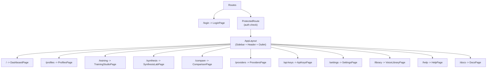
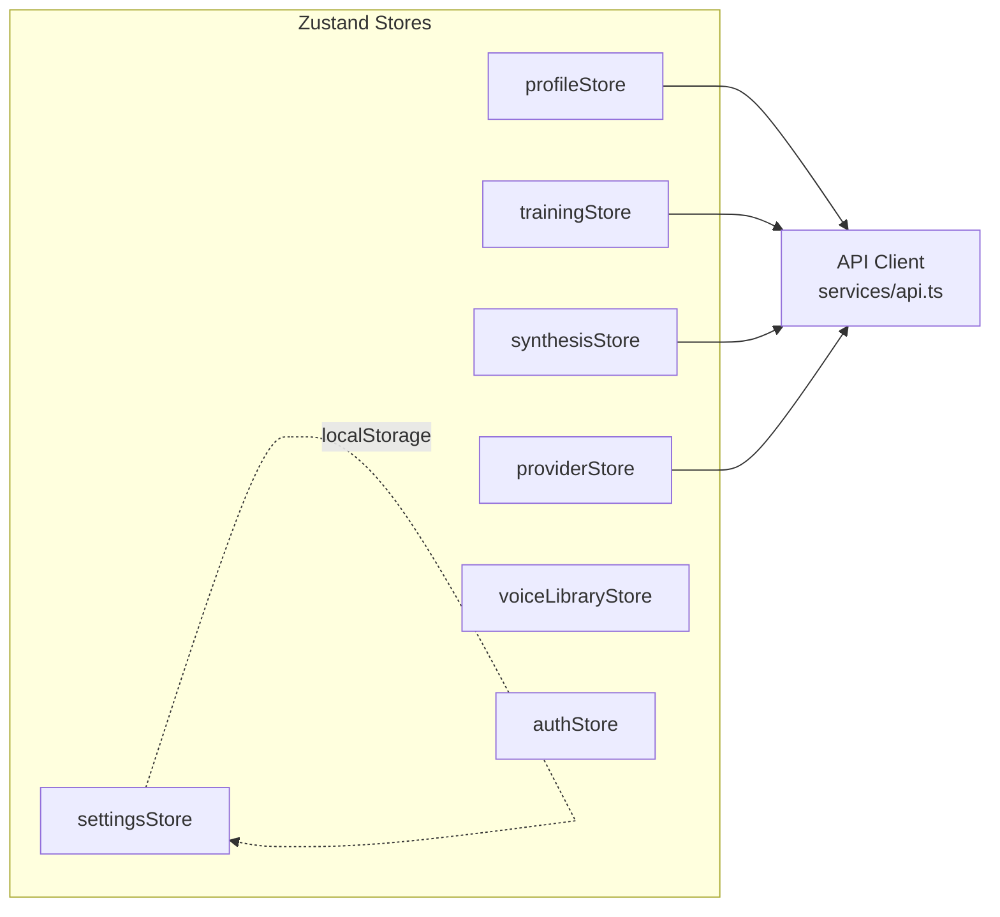

# Atlas Vox Frontend Architecture

> **React 18 single-page application for voice profile management, training, synthesis, and comparison.**

The Atlas Vox frontend is a modern SPA built with React 18, TypeScript 5, Vite, Tailwind CSS, and Zustand. It communicates with the backend exclusively through a REST API client and WebSocket connections for real-time training progress.

---

## Table of Contents

- [Technology Stack](#technology-stack)
- [Project Structure](#project-structure)
- [Routing](#routing)
- [State Management](#state-management)
  - [profileStore](#profilestore)
  - [trainingStore](#trainingstore)
  - [synthesisStore](#synthesisstore)
  - [providerStore](#providerstore)
  - [settingsStore](#settingsstore)
- [API Client](#api-client)
- [TypeScript Interfaces](#typescript-interfaces)
- [Component Architecture](#component-architecture)
  - [Layout Components](#layout-components)
  - [UI Components](#ui-components)
  - [Audio Components](#audio-components)
  - [Pages](#pages)
- [Theme System](#theme-system)
- [Responsive Design](#responsive-design)
- [Real-Time Updates](#real-time-updates)
- [Adding a New Page](#adding-a-new-page)

---

## Technology Stack

| Technology | Version | Purpose |
|---|---|---|
| **React** | 18+ | Component framework |
| **TypeScript** | 5+ | Type safety (strict mode) |
| **Vite** | 5+ | Build tool and dev server |
| **Tailwind CSS** | 3+ | Utility-first styling |
| **Zustand** | 4+ | State management |
| **React Router** | 6 | Client-side routing with lazy loading |
| **Sonner** | -- | Toast notifications |
| **Lucide React** | -- | Icon library |
| **clsx** | -- | Conditional CSS class names |

---

## Project Structure

```
frontend/src/
+-- App.tsx                     # Root component, route definitions
+-- main.tsx                    # Entry point, React DOM render
+-- components/
|   +-- layout/
|   |   +-- AppLayout.tsx       # Shell: sidebar + header + content
|   |   +-- Sidebar.tsx         # Navigation sidebar with 8 nav items
|   |   +-- Header.tsx          # Top bar with theme toggle
|   +-- ui/
|   |   +-- Button.tsx          # Variant button (primary/secondary/danger/ghost)
|   |   +-- Input.tsx           # Text input
|   |   +-- TextArea.tsx        # Multi-line text input
|   |   +-- Select.tsx          # Dropdown select
|   |   +-- Modal.tsx           # Dialog overlay
|   |   +-- Card.tsx            # Content card container
|   |   +-- Slider.tsx          # Range slider
|   |   +-- ProgressBar.tsx     # Progress indicator
|   |   +-- Badge.tsx           # Status/tag badge
|   +-- audio/
|       +-- AudioPlayer.tsx     # Playback with seek bar and time display
|       +-- AudioRecorder.tsx   # Browser microphone recording + file upload
+-- pages/
|   +-- DashboardPage.tsx       # Overview with stats and recent activity
|   +-- ProfilesPage.tsx        # Voice profile CRUD
|   +-- TrainingStudioPage.tsx  # Sample upload, training launch, progress
|   +-- SynthesisLabPage.tsx    # Text-to-speech with controls
|   +-- ComparisonPage.tsx      # Side-by-side voice comparison
|   +-- ProvidersPage.tsx       # Provider list, health checks
|   +-- ApiKeysPage.tsx         # API key management
|   +-- SettingsPage.tsx        # User preferences
+-- stores/
|   +-- profileStore.ts         # Voice profiles state
|   +-- trainingStore.ts        # Training jobs state
|   +-- synthesisStore.ts       # Synthesis state and history
|   +-- providerStore.ts        # Provider list and health
|   +-- settingsStore.ts        # Theme, defaults (persisted to localStorage)
+-- services/
|   +-- api.ts                  # REST API client (singleton)
+-- hooks/
|   +-- useWebSocket.ts         # WebSocket hook for training progress
+-- types/
|   +-- index.ts                # Shared TypeScript interfaces
+-- styles/
    +-- globals.css             # CSS custom properties, Tailwind directives
```

---

## Routing

Routing uses React Router v6 with a shared layout, lazy-loaded pages, and an authentication guard.



**Route table:**

| Path | Page Component | Description |
|---|---|---|
| `/login` | `LoginPage` | JWT token or API key login (unprotected) |
| `/` | `DashboardPage` | Overview dashboard (index route) |
| `/profiles` | `ProfilesPage` | Voice profile management |
| `/training` | `TrainingStudioPage` | Sample upload and training |
| `/synthesis` | `SynthesisLabPage` | Text-to-speech synthesis |
| `/compare` | `ComparisonPage` | Side-by-side voice comparison |
| `/library` | `VoiceLibraryPage` | Browse all provider voices |
| `/providers` | `ProvidersPage` | TTS provider status |
| `/api-keys` | `ApiKeysPage` | API key management |
| `/settings` | `SettingsPage` | User preferences |
| `/help` | `HelpPage` | Help & documentation |
| `/docs` | `DocsPage` | Provider setup guides |

**Authentication:** All routes except `/login` are wrapped in `ProtectedRoute`, which checks `useAuthStore().isAuthenticated`. When `AUTH_DISABLED=true` on the backend, the App component auto-authenticates by hitting `/api/v1/health` — if it succeeds without auth headers, a synthetic token is set and the user bypasses the login page.

**LoginPage** accepts either a JWT token (contains `.`) or an API key. The token/key is stored in the auth store and injected into all subsequent API requests.

**Lazy loading:** All page components are loaded via `React.lazy()` and wrapped in `<Suspense>` with a spinner fallback:

```tsx
const DashboardPage = lazy(() => import("./pages/DashboardPage"));

<Suspense fallback={<PageLoader />}>
  <DashboardPage />
</Suspense>
```

The `PageLoader` component renders a centered spinning circle indicator.

---

## State Management

Atlas Vox uses **7 Zustand stores**, one per domain. Each store follows the same pattern: state fields, an async fetch action, and mutation actions that optimistically update local state. All stores include AbortController integration to cancel in-flight requests and staleness guards to avoid redundant API calls.



---

### profileStore

Manages the list of voice profiles.

**State:**

| Field | Type | Description |
|---|---|---|
| `profiles` | `VoiceProfile[]` | All loaded profiles |
| `loading` | `boolean` | Fetch in progress |
| `error` | `string | null` | Last error message |

**Actions:**

| Action | Signature | Description |
|---|---|---|
| `fetchProfiles` | `() => Promise<void>` | Load all profiles from API |
| `createProfile` | `(data) => Promise<VoiceProfile>` | Create and prepend to list |
| `updateProfile` | `(id, data) => Promise<void>` | Update in-place |
| `deleteProfile` | `(id) => Promise<void>` | Remove from list |
| `activateVersion` | `(profileId, versionId) => Promise<void>` | Set active model version |

---

### trainingStore

Manages training job lifecycle.

**State:**

| Field | Type | Description |
|---|---|---|
| `jobs` | `TrainingJob[]` | All loaded training jobs |
| `loading` | `boolean` | Fetch in progress |
| `error` | `string | null` | Last error message |

**Actions:**

| Action | Signature | Description |
|---|---|---|
| `fetchJobs` | `(params?) => Promise<void>` | Load jobs with optional filters (`profile_id`, `status`) |
| `startTraining` | `(profileId, data?) => Promise<TrainingJob>` | Start a training job |
| `cancelJob` | `(jobId) => Promise<void>` | Cancel a running job |
| `refreshJob` | `(jobId) => Promise<TrainingJob>` | Refresh a single job's status |

---

### synthesisStore

Manages text-to-speech synthesis and comparison results.

**State:**

| Field | Type | Description |
|---|---|---|
| `lastResult` | `SynthesisResult | null` | Most recent synthesis output |
| `history` | `any[]` | Synthesis history entries |
| `comparing` | `boolean` | Comparison in progress |
| `comparisonResults` | `any[]` | Comparison output entries |
| `loading` | `boolean` | Synthesis in progress |
| `error` | `string | null` | Last error message |

**Actions:**

| Action | Signature | Description |
|---|---|---|
| `synthesize` | `(data) => Promise<SynthesisResult>` | Synthesize text and store result |
| `compare` | `(data) => Promise<void>` | Compare text across profiles |
| `fetchHistory` | `(limit?) => Promise<void>` | Load synthesis history |

The `SynthesisResult` includes: `id`, `audio_url`, `duration_seconds`, `latency_ms`, `profile_id`, `provider_name`.

---

### providerStore

Manages TTS provider listing and health status.

**State:**

| Field | Type | Description |
|---|---|---|
| `providers` | `Provider[]` | All known providers |
| `loading` | `boolean` | Fetch in progress |
| `error` | `string | null` | Last error message |

**Actions:**

| Action | Signature | Description |
|---|---|---|
| `fetchProviders` | `() => Promise<void>` | Load all providers |
| `checkHealth` | `(name) => Promise<void>` | Run health check and update in-place |

---

### settingsStore

User preferences persisted to `localStorage` via Zustand's `persist` middleware.

**State:**

| Field | Type | Default | Description |
|---|---|---|---|
| `theme` | `"light" | "dark"` | `"light"` | Current color theme |
| `defaultProvider` | `string` | `"kokoro"` | Default provider for new profiles |
| `audioFormat` | `string` | `"wav"` | Default audio output format |

**Actions:**

| Action | Signature | Description |
|---|---|---|
| `toggleTheme` | `() => void` | Switch between light and dark; toggles `dark` class on `<html>` |
| `setDefaultProvider` | `(provider) => void` | Set default provider |
| `setAudioFormat` | `(format) => void` | Set default audio format |

**Persistence key:** `atlas-vox-settings` in `localStorage`.

---

## API Client

All backend communication goes through a single `ApiClient` class in `frontend/src/services/api.ts`. It wraps the Fetch API with JSON handling, error extraction, `FormData` support for file uploads, automatic auth header injection, and retry with exponential backoff.

**Base URL:** `/api/v1` (proxied to backend by Vite dev server)

**Authentication:** The API client automatically reads the current token/apiKey from `useAuthStore.getState()` and injects an `Authorization: Bearer <token>` header on every request.

**Retry Logic:** All requests use `fetchWithRetry()` which retries transient failures (network errors, 502, 503, 504) up to 3 times with exponential backoff (1s, 2s, 4s base delays, max 8s, plus random jitter to prevent thundering herd).

**Method groups:**

| Group | Methods | Description |
|---|---|---|
| **Health** | `health()` | Server health check |
| **Profiles** | `listProfiles()`, `getProfile()`, `createProfile()`, `updateProfile()`, `deleteProfile()` | CRUD for voice profiles |
| **Versions** | `listVersions()`, `activateVersion()` | Model version management |
| **Samples** | `uploadSamples()`, `listSamples()`, `deleteSample()`, `getSampleAnalysis()`, `preprocessSamples()` | Audio sample management |
| **Training** | `startTraining()`, `listTrainingJobs()`, `getTrainingJob()`, `cancelTrainingJob()` | Training job lifecycle |
| **Synthesis** | `synthesize()`, `batchSynthesize()`, `getSynthesisHistory()` | TTS synthesis |
| **Comparison** | `compare()` | Side-by-side voice comparison |
| **Providers** | `listProviders()`, `getProvider()`, `checkProviderHealth()`, `listProviderVoices()` | Provider management |
| **Presets** | `listPresets()`, `createPreset()`, `updatePreset()`, `deletePreset()` | Persona preset CRUD |
| **API Keys** | `listApiKeys()`, `createApiKey()`, `revokeApiKey()` | API key management |
| **Audio** | `audioUrl(filename)` | Build playback URL for audio files |

**Error handling:** Non-2xx responses are parsed for a `detail` field (FastAPI convention) and thrown as `Error` objects. The stores catch these and set their `error` state.

**File uploads:** When the request body is a `FormData` instance, the `Content-Type` header is automatically removed so the browser can set the correct multipart boundary.

---

## TypeScript Interfaces

Core types are defined in `frontend/src/types/index.ts`:

### VoiceProfile

```typescript
interface VoiceProfile {
  id: string;
  name: string;
  description: string | null;
  language: string;
  provider_name: string;
  status: "pending" | "training" | "ready" | "error" | "archived";
  tags: string[] | null;
  active_version_id: string | null;
  sample_count: number;
  version_count: number;
  created_at: string;
  updated_at: string;
}
```

### Provider

```typescript
interface Provider {
  id: string;
  name: string;
  display_name: string;
  provider_type: "cloud" | "local";
  enabled: boolean;
  gpu_mode: string;
  capabilities: ProviderCapabilities | null;
  health: ProviderHealth | null;
}

interface ProviderCapabilities {
  supports_cloning: boolean;
  supports_fine_tuning: boolean;
  supports_streaming: boolean;
  supports_ssml: boolean;
  supports_zero_shot: boolean;
  supports_batch: boolean;
  requires_gpu: boolean;
  gpu_mode: string;
  min_samples_for_cloning: number;
  max_text_length: number;
  supported_languages: string[];
  supported_output_formats: string[];
}

interface ProviderHealth {
  name: string;
  healthy: boolean;
  latency_ms: number | null;
  error: string | null;
}
```

### TrainingJob

```typescript
interface TrainingJob {
  id: string;
  profile_id: string;
  provider_name: string;
  status: "queued" | "preprocessing" | "training" | "completed" | "failed" | "cancelled";
  progress: number;                    // 0.0 to 1.0
  error_message: string | null;
  result_version_id: string | null;
  started_at: string | null;
  completed_at: string | null;
  created_at: string;
}
```

### PersonaPreset

```typescript
interface PersonaPreset {
  id: string;
  name: string;
  description: string | null;
  speed: number;
  pitch: number;
  volume: number;
  is_system: boolean;
}
```

---

## Component Architecture

### Layout Components

The application shell is composed of three layout components:

```
+--------------------------------------------+
|              AppLayout                       |
| +--------+ +------------------------------+ |
| |        | |          Header               | |
| | Side-  | +------------------------------+ |
| | bar    | |                               | |
| |        | |          <Outlet />           | |
| |  nav   | |      (page content)           | |
| |  items | |                               | |
| |        | |                               | |
| +--------+ +------------------------------+ |
+--------------------------------------------+
```

**`AppLayout`** (`components/layout/AppLayout.tsx`)
- Flexbox container with `h-screen overflow-hidden`
- Contains `<Sidebar />` and a right column with `<Header />` and `<Outlet />`
- The `<Outlet />` renders the matched route's page component

**`Sidebar`** (`components/layout/Sidebar.tsx`)
- Fixed 256px-wide navigation panel
- 8 navigation items with Lucide icons
- Active route highlighted with primary color
- Mobile: hidden by default, toggled via hamburger button with overlay backdrop
- Desktop: always visible (CSS `@media (min-width: 768px)`)

**Navigation items:**

| Route | Icon | Label |
|---|---|---|
| `/` | `LayoutDashboard` | Dashboard |
| `/profiles` | `Mic` | Voice Profiles |
| `/training` | `GraduationCap` | Training Studio |
| `/synthesis` | `AudioLines` | Synthesis Lab |
| `/compare` | `GitCompareArrows` | Comparison |
| `/providers` | `Settings2` | Providers |
| `/api-keys` | `Key` | API Keys |
| `/settings` | `Settings` | Settings |

**`Header`** (`components/layout/Header.tsx`)
- 64px-tall top bar
- Contains a theme toggle button (Sun/Moon icons from Lucide)
- Uses `useSettingsStore` to read and toggle the theme

---

### UI Components

Reusable building blocks in `components/ui/`:

| Component | Props | Description |
|---|---|---|
| `Button` | `variant`, `size`, `disabled` | 4 variants (primary, secondary, danger, ghost), 3 sizes (sm, md, lg) |
| `Input` | Standard HTML input props | Styled text input |
| `TextArea` | Standard HTML textarea props | Multi-line text input |
| `Select` | Standard HTML select props | Dropdown select |
| `Modal` | Children, open state | Dialog overlay with backdrop |
| `Card` | Children | Bordered content container |
| `Slider` | Value, onChange | Range slider control |
| `ProgressBar` | Value (0-100) | Horizontal progress indicator |
| `Badge` | Children, variant | Status/tag badge |

**Button variants:**

| Variant | Appearance |
|---|---|
| `primary` | Solid primary color (blue/purple), white text |
| `secondary` | Gray background, dark text (adapts to dark mode) |
| `danger` | Red background, white text |
| `ghost` | Transparent, colored on hover |

---

### Audio Components

Specialized components for audio interaction:

**`AudioPlayer`** (`components/audio/AudioPlayer.tsx`)
- HTML5 `<audio>` element with custom controls
- Play/pause toggle button
- Clickable seek bar with progress indicator
- Time display (current / total) in `m:ss` format
- `compact` mode for inline use
- Resets state when `src` changes

**`AudioRecorder`** (`components/audio/AudioRecorder.tsx`)
- Uses `MediaRecorder` API for browser-based recording
- Records in `audio/webm` format
- Shows elapsed time counter while recording
- Red pulsing indicator during recording
- Calls `onRecorded(blob, filename)` callback with the recorded audio

**`FileUploader`** (exported from `AudioRecorder.tsx`)
- Drag-and-drop file upload zone
- Click-to-browse with hidden `<input type="file">`
- Filters for `audio/*` MIME type
- Accepts multiple files
- Shows supported formats: WAV, MP3, FLAC, OGG

---

### Pages

Each page is a standalone component that composes stores, API calls, and UI components:

| Page | Primary Store(s) | Key Features |
|---|---|---|
| `DashboardPage` | All stores | Summary stats, recent activity, quick actions |
| `ProfilesPage` | `profileStore` | Profile list, create/edit modals, status badges |
| `TrainingStudioPage` | `trainingStore`, `profileStore` | Sample upload, training launch, progress monitoring |
| `SynthesisLabPage` | `synthesisStore`, `profileStore` | Text input, voice selection, playback, SSML toggle |
| `ComparisonPage` | `synthesisStore`, `profileStore` | Multi-voice selection, parallel synthesis, comparison table |
| `ProvidersPage` | `providerStore` | Provider cards, health check buttons, capability display |
| `ApiKeysPage` | Direct API calls | Key list, create dialog, revoke confirmation |
| `SettingsPage` | `settingsStore` | Theme toggle, default provider, audio format |

---

## Theme System

Atlas Vox implements light/dark theming via CSS custom properties and the Tailwind `dark:` variant.

### CSS Custom Properties

Defined in `frontend/src/styles/globals.css`:

| Property | Light | Dark | Usage |
|---|---|---|---|
| `--color-bg` | `#ffffff` | `#111827` | Page background |
| `--color-bg-secondary` | `#f9fafb` | `#1f2937` | Card/panel backgrounds |
| `--color-text` | `#111827` | `#f9fafb` | Primary text |
| `--color-text-secondary` | `#6b7280` | `#9ca3af` | Muted/secondary text |
| `--color-border` | `#e5e7eb` | `#374151` | Borders and dividers |
| `--color-sidebar` | `#f3f4f6` | `#1f2937` | Sidebar background |

### How Theme Switching Works

1. The `settingsStore.toggleTheme()` action adds or removes the `dark` class on `document.documentElement`
2. CSS rules under `.dark { ... }` override the custom property values
3. Tailwind's `dark:` variant classes activate when the `dark` class is present
4. The setting is persisted to `localStorage` under the key `atlas-vox-settings`

```
User clicks Moon/Sun icon
  --> settingsStore.toggleTheme()
    --> document.documentElement.classList.toggle("dark")
    --> Zustand persist middleware saves to localStorage
    --> CSS custom properties update via .dark selector
    --> Tailwind dark: classes activate/deactivate
```

---

## Responsive Design

The frontend uses a mobile-first responsive approach:

| Breakpoint | Behavior |
|---|---|
| `< 768px` (mobile) | Sidebar hidden, toggle via hamburger menu. Full-width content. Overlay backdrop. |
| `>= 768px` (desktop) | Sidebar always visible at 256px width. Content fills remaining space. |

**Key implementation details:**

- The sidebar uses `position: fixed` on mobile with a `left` style animated via CSS transition
- A `z-30` overlay (`bg-black/50`) covers the content when the mobile sidebar is open
- The mobile hamburger button is `fixed top-4 left-4 z-50` and uses `md:hidden` to disappear on desktop
- The CSS rule `@media (min-width: 768px) { .sidebar { position: relative !important; left: 0 !important; } }` overrides the mobile positioning on desktop

---

## Real-Time Updates

Training job progress is streamed via WebSocket in the `useTrainingProgress` hook.

### useTrainingProgress

```typescript
function useTrainingProgress(jobId: string | null): {
  progress: WSProgress | null;
  connected: boolean;
}
```

| Field | Type | Description |
|---|---|---|
| `progress.job_id` | `string` | Job being tracked |
| `progress.state` | `string` | Celery task state |
| `progress.percent` | `number` | 0-100 progress |
| `progress.status` | `string` | Human-readable status |
| `progress.version_id` | `string?` | Result version (on completion) |
| `progress.error` | `string?` | Error message (on failure) |

**WebSocket URL pattern:**

```
ws[s]://<host>/api/v1/training/jobs/{jobId}/progress
```

**Auto-close:** The WebSocket connection automatically closes when the job reaches a terminal state (`DONE`, `FAILURE`, `REVOKED`).

**Reconnection:** The hook reconnects when the `jobId` parameter changes via the `useEffect` cleanup/re-run cycle.

---

## Adding a New Page

Follow these steps to add a new page to the application:

### Step 1: Create the Page Component

Create a new file in `frontend/src/pages/`:

```tsx
// frontend/src/pages/MyNewPage.tsx
export default function MyNewPage() {
  return (
    <div>
      <h1 className="text-2xl font-bold mb-6">My New Page</h1>
      {/* page content */}
    </div>
  );
}
```

### Step 2: Add the Lazy Import and Route

In `frontend/src/App.tsx`:

```tsx
const MyNewPage = lazy(() => import("./pages/MyNewPage"));

// Inside the <Route element={<AppLayout />}> block:
<Route
  path="my-page"
  element={
    <Suspense fallback={<PageLoader />}>
      <MyNewPage />
    </Suspense>
  }
/>
```

### Step 3: Add Navigation

In `frontend/src/components/layout/Sidebar.tsx`, add an entry to the `navItems` array:

```tsx
import { FileText } from "lucide-react"; // choose an appropriate icon

const navItems = [
  // ... existing items
  { to: "/my-page", icon: FileText, label: "My Page" },
];
```

### Step 4: Create a Store (if needed)

If the page needs shared state, create a store in `frontend/src/stores/`:

```tsx
// frontend/src/stores/myStore.ts
import { create } from "zustand";
import { api } from "../services/api";

interface MyState {
  data: any[];
  loading: boolean;
  error: string | null;
  fetchData: () => Promise<void>;
}

export const useMyStore = create<MyState>((set) => ({
  data: [],
  loading: false,
  error: null,

  fetchData: async () => {
    set({ loading: true, error: null });
    try {
      const data = await api.request("/my-endpoint");
      set({ data, loading: false });
    } catch (e: any) {
      set({ error: e.message, loading: false });
    }
  },
}));
```

### Step 5: Add API Methods (if needed)

In `frontend/src/services/api.ts`, add methods to the `ApiClient` class:

```tsx
// Inside the ApiClient class
listMyData() {
  return this.request<{ items: any[]; count: number }>("/my-endpoint");
}

createMyItem(data: { name: string }) {
  return this.request<any>("/my-endpoint", { method: "POST", body: JSON.stringify(data) });
}
```

### Step 6: Add Types (if needed)

In `frontend/src/types/index.ts`:

```typescript
export interface MyItem {
  id: string;
  name: string;
  created_at: string;
}
```

### Checklist

- [ ] Page component created in `pages/`
- [ ] Lazy import and route added in `App.tsx`
- [ ] Navigation item added in `Sidebar.tsx`
- [ ] Store created in `stores/` (if needed)
- [ ] API methods added in `services/api.ts` (if needed)
- [ ] Types added in `types/index.ts` (if needed)
- [ ] Toast notifications for success/error (import from `sonner`)
