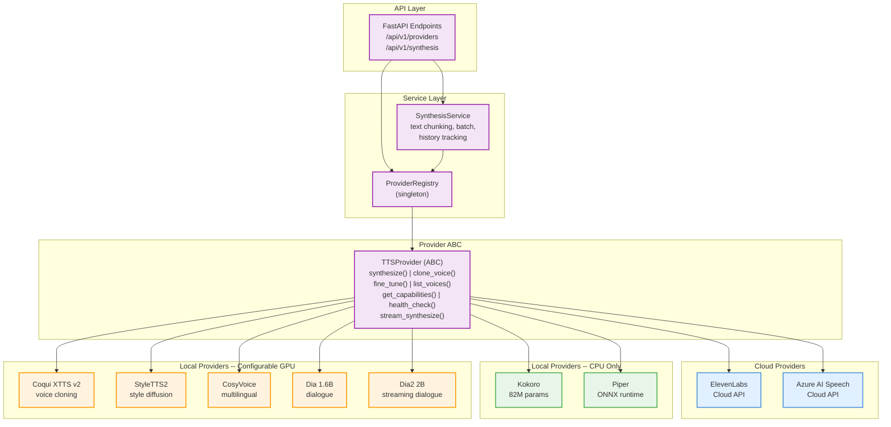
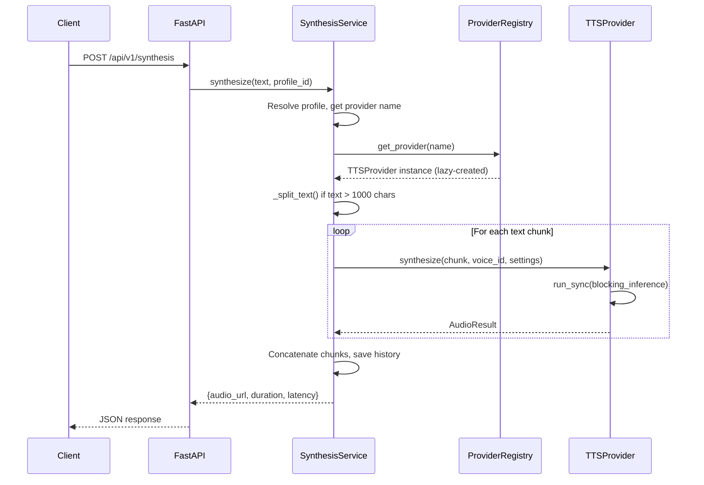
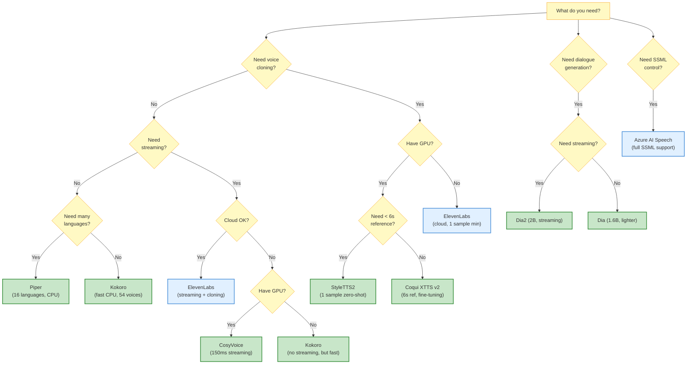
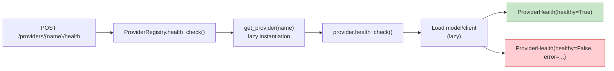

# Atlas Vox -- TTS Provider Guide

> **Comprehensive reference for all 9 text-to-speech providers** supported by Atlas Vox.
> Covers architecture, configuration, capabilities, GPU modes, and how to add your own.

---

## Table of Contents

- [1. Provider Architecture Overview](#1-provider-architecture-overview)
  - [1.1 The ABC Pattern](#11-the-abc-pattern)
  - [1.2 Capability Declaration](#12-capability-declaration)
  - [1.3 The Provider Registry](#13-the-provider-registry)
  - [1.4 Architecture Diagram](#14-architecture-diagram)
- [2. Provider Comparison Matrix](#2-provider-comparison-matrix)
  - [2.1 At a Glance](#21-at-a-glance)
  - [2.2 Feature Matrix](#22-feature-matrix)
  - [2.3 Language Support Matrix](#23-language-support-matrix)
  - [2.4 Decision Flowchart](#24-decision-flowchart)
- [3. Provider Deep Dives](#3-provider-deep-dives)
  - [3.1 Kokoro -- Default, Lightweight, CPU-Only](#31-kokoro----default-lightweight-cpu-only)
  - [3.2 Piper -- ONNX, Home Assistant Compatible](#32-piper----onnx-home-assistant-compatible)
  - [3.3 ElevenLabs -- Cloud API with Voice Cloning](#33-elevenlabs----cloud-api-with-voice-cloning)
  - [3.4 Azure AI Speech -- Cloud, SSML, Custom Neural Voice](#34-azure-ai-speech----cloud-ssml-custom-neural-voice)
  - [3.5 Coqui XTTS v2 -- Voice Cloning from 6s Audio](#35-coqui-xtts-v2----voice-cloning-from-6s-audio)
  - [3.6 StyleTTS2 -- Zero-Shot Style Diffusion](#36-styletts2----zero-shot-style-diffusion)
  - [3.7 CosyVoice -- Multilingual Streaming](#37-cosyvoice----multilingual-streaming)
  - [3.8 Dia -- 1.6B Dialogue Model](#38-dia----16b-dialogue-model)
  - [3.9 Dia2 -- 2B Streaming Dialogue](#39-dia2----2b-streaming-dialogue)
- [4. Adding a Custom Provider](#4-adding-a-custom-provider)
- [5. GPU Mode Configuration](#5-gpu-mode-configuration)
- [6. Health Check and Troubleshooting](#6-health-check-and-troubleshooting)

---

## 1. Provider Architecture Overview

Atlas Vox uses a **provider abstraction pattern** to unify 9 different TTS engines -- 2 cloud services and 7 local models -- behind a single interface. The frontend adapts its UI dynamically based on each provider's declared capabilities.

### 1.1 The ABC Pattern

Every provider extends the `TTSProvider` abstract base class defined in `backend/app/providers/base.py`. The ABC enforces six mandatory methods:

```python
class TTSProvider(ABC):

    @abstractmethod
    async def synthesize(
        self, text: str, voice_id: str, settings: SynthesisSettings
    ) -> AudioResult:
        """Synthesize text to speech."""

    @abstractmethod
    async def clone_voice(
        self, samples: list[AudioSample], config: CloneConfig
    ) -> VoiceModel:
        """Clone a voice from audio samples (if supported)."""

    @abstractmethod
    async def fine_tune(
        self, model_id: str, samples: list[AudioSample], config: FineTuneConfig
    ) -> VoiceModel:
        """Fine-tune an existing model (if supported)."""

    @abstractmethod
    async def list_voices(self) -> list[VoiceInfo]:
        """List available voices/models."""

    @abstractmethod
    async def get_capabilities(self) -> ProviderCapabilities:
        """Return provider capability flags for UI adaptation."""

    @abstractmethod
    async def health_check(self) -> ProviderHealth:
        """Check if provider is reachable and operational."""

    # Optional -- override to enable streaming
    async def stream_synthesize(
        self, text: str, voice_id: str, settings: SynthesisSettings
    ) -> AsyncIterator[bytes]:
        raise NotImplementedError("Streaming not supported by this provider")
```

**Key data classes** that flow through the system:

| Data Class | Purpose |
|---|---|
| `SynthesisSettings` | Speed, pitch, volume, output format, SSML flag |
| `AudioResult` | Output file path, duration, sample rate, format |
| `AudioSample` | Input sample for training (file path, duration, sample rate) |
| `CloneConfig` | Voice cloning parameters (name, description, language) |
| `FineTuneConfig` | Training hyperparameters (epochs, learning rate, batch size) |
| `VoiceInfo` | Voice metadata (ID, name, language, preview URL) |
| `VoiceModel` | Result of cloning/training (model ID, path, metrics) |
| `ProviderCapabilities` | Feature flags the UI reads to adapt dynamically |
| `ProviderHealth` | Health status (healthy, latency, error message) |

**Design decision -- `run_sync` helper.** All local models perform blocking inference. The `run_sync` utility runs these in a thread executor so they never block the FastAPI async event loop:

```python
async def run_sync(func, *args, **kwargs):
    loop = asyncio.get_running_loop()
    return await loop.run_in_executor(None, partial(func, *args, **kwargs))
```

### 1.2 Capability Declaration

Every provider returns a `ProviderCapabilities` dataclass from `get_capabilities()`. The frontend inspects these flags to show or hide UI elements (e.g., hide the "Clone Voice" button for Kokoro, show SSML editor only for Azure).

```python
@dataclass
class ProviderCapabilities:
    supports_cloning: bool = False
    supports_fine_tuning: bool = False
    supports_streaming: bool = False
    supports_ssml: bool = False
    supports_zero_shot: bool = False
    supports_batch: bool = False
    requires_gpu: bool = False
    gpu_mode: str = "none"        # none | host_cpu | docker_gpu | configurable
    min_samples_for_cloning: int = 0
    max_text_length: int = 5000
    supported_languages: list[str] = field(default_factory=lambda: ["en"])
    supported_output_formats: list[str] = field(default_factory=lambda: ["wav"])
```

**`gpu_mode` values explained:**

| Value | Meaning |
|---|---|
| `"none"` | CPU-only provider, no GPU option |
| `"host_cpu"` | Running on host CPU (default for configurable providers) |
| `"docker_gpu"` | Running inside a GPU-enabled Docker container |
| `"configurable"` | User can switch between `host_cpu` and `docker_gpu` |

### 1.3 The Provider Registry

The `ProviderRegistry` singleton in `backend/app/services/provider_registry.py` is the central lookup for all providers. It handles:

- **Lazy instantiation** -- providers are only created when first requested
- **Name-to-class mapping** -- flat dictionary of string keys to provider classes
- **Capability querying** -- delegates to each provider's `get_capabilities()`
- **Health checks** -- wraps each provider's `health_check()` with error handling
- **Discovery** -- exposes `list_all_known()` for the API and UI

```python
PROVIDER_CLASSES: dict[str, type[TTSProvider]] = {
    "kokoro": KokoroTTSProvider,
    "coqui_xtts": CoquiXTTSProvider,
    "piper": PiperTTSProvider,
    "elevenlabs": ElevenLabsProvider,
    "azure_speech": AzureSpeechProvider,
    "styletts2": StyleTTS2Provider,
    "cosyvoice": CosyVoiceProvider,
    "dia": DiaProvider,
    "dia2": Dia2Provider,
}
```

Providers are also tagged by type (`local` or `cloud`) and given display names:

```python
PROVIDER_TYPES = {
    "kokoro": "local",    "coqui_xtts": "local",    "piper": "local",
    "elevenlabs": "cloud", "azure_speech": "cloud",
    "styletts2": "local",  "cosyvoice": "local",
    "dia": "local",        "dia2": "local",
}
```

### 1.4 Architecture Diagram



**Data flow for a synthesis request:**



---

## 2. Provider Comparison Matrix

### 2.1 At a Glance

| Provider | Type | Model Size | GPU | Sample Rate | Default Format | Built-in Voices |
|---|---|---|---|---|---|---|
| **Kokoro** | Local | 82M | None (CPU) | 24,000 Hz | WAV | 54 |
| **Piper** | Local | Varies (ONNX) | None (CPU) | 22,050 Hz | WAV | 9+ (downloadable) |
| **ElevenLabs** | Cloud | N/A | None (API) | 44,100 Hz | MP3 | API-managed |
| **Azure AI Speech** | Cloud | N/A | None (API) | 16,000 Hz | WAV | 400+ (API-managed) |
| **Coqui XTTS v2** | Local | ~1.5B | Configurable | 22,050 Hz | WAV | 1 (clone for more) |
| **StyleTTS2** | Local | ~200M | Configurable | 24,000 Hz | WAV | 1 (zero-shot) |
| **CosyVoice** | Local | 300M | Configurable | 22,050 Hz | WAV | 8 |
| **Dia** | Local | 1.6B | Configurable | Model default | WAV | 2 (S1, S2) |
| **Dia2** | Local | 2B | Configurable | Model default | WAV | 2 (S1, S2) |

### 2.2 Feature Matrix

| Provider | Cloning | Fine-Tuning | Streaming | SSML | Zero-Shot | Batch | Max Text |
|---|---|---|---|---|---|---|---|
| **Kokoro** | -- | -- | -- | -- | -- | Yes | 5,000 |
| **Piper** | -- | Yes | -- | -- | -- | Yes | 5,000 |
| **ElevenLabs** | Yes (1+ sample) | -- | Yes | -- | -- | Yes | 5,000 |
| **Azure AI Speech** | Yes (CNV) | -- | Yes | **Yes** | -- | Yes | **10,000** |
| **Coqui XTTS v2** | **Yes (6s ref)** | **Yes** | Yes | -- | **Yes** | Yes | 5,000 |
| **StyleTTS2** | Yes (1+ sample) | Yes | -- | -- | **Yes** | Yes | 5,000 |
| **CosyVoice** | Yes (1+ sample) | -- | Yes | -- | **Yes** | Yes | 5,000 |
| **Dia** | Yes (5-10s ref) | -- | -- | -- | -- | Yes | 5,000 |
| **Dia2** | -- | -- | Yes | -- | -- | Yes | 5,000 |

> **Legend:** "Yes" = natively supported | "--" = not supported | **Bold** = standout capability for that feature

### 2.3 Language Support Matrix

| Provider | en | es | fr | de | it | pt | zh | ja | ko | ar | ru | nl | pl | Others |
|---|---|---|---|---|---|---|---|---|---|---|---|---|---|---|
| **Kokoro** | Yes | | | | | | | | | | | | | |
| **Piper** | Yes | Yes | Yes | Yes | Yes | Yes | Yes | | | Yes | Yes | Yes | Yes | fi, sv, no, da, uk |
| **ElevenLabs** | Yes | Yes | Yes | Yes | Yes | Yes | Yes | Yes | Yes | Yes | Yes | Yes | Yes | hi, sv, tr |
| **Azure AI Speech** | Yes | Yes | Yes | Yes | Yes | Yes | Yes | Yes | Yes | Yes | Yes | Yes | Yes | hi, sv, tr |
| **Coqui XTTS v2** | Yes | Yes | Yes | Yes | Yes | Yes | Yes | Yes | Yes | Yes | Yes | Yes | Yes | cs, tr, hu |
| **StyleTTS2** | Yes | | | | | | | | | | | | | |
| **CosyVoice** | Yes | Yes | Yes | Yes | Yes | Yes | Yes | Yes | Yes | | | | | |
| **Dia** | Yes | | | | | | | | | | | | | |
| **Dia2** | Yes | | | | | | | | | | | | | |

### 2.4 Decision Flowchart

Use this flowchart to choose the right provider for your use case:



---

## 3. Provider Deep Dives

---

### 3.1 Kokoro -- Default, Lightweight, CPU-Only

**The recommended starting provider.** Kokoro delivers high-quality English speech with 54 built-in voices, an 82M parameter model, and zero GPU requirements. It is Atlas Vox's default provider.

| Property | Value |
|---|---|
| **Module** | `backend/app/providers/kokoro_tts.py` |
| **Class** | `KokoroTTSProvider` |
| **Registry key** | `kokoro` |
| **Type** | Local |
| **Model size** | 82M parameters |
| **Sample rate** | 24,000 Hz |
| **Output format** | WAV |
| **GPU mode** | `none` (CPU only) |

#### Key Features

- 54 built-in voices spanning American and British English, male and female
- Voice naming convention: `{accent}{gender}_{name}` -- e.g., `af_heart` = American Female "Heart"
  - `a` = American, `b` = British
  - `f` = Female, `m` = Male
- Fast CPU inference -- no GPU, no cloud API keys
- Lazy pipeline loading via `KPipeline(lang_code="a")`

#### Environment Variables

| Variable | Default | Description |
|---|---|---|
| `KOKORO_ENABLED` | `true` | Enable/disable the Kokoro provider |

No API keys or model downloads required -- the `kokoro` package bundles everything.

#### Setup

```bash
pip install kokoro>=0.9.4 soundfile numpy
```

That is it. No model downloads, no API keys. The pipeline loads on first use.

#### Built-in Voices (sample)

| Voice ID | Name | Accent |
|---|---|---|
| `af_heart` | Heart | American Female |
| `af_bella` | Bella | American Female |
| `af_sarah` | Sarah | American Female |
| `af_nicole` | Nicole | American Female |
| `am_adam` | Adam | American Male |
| `am_michael` | Michael | American Male |
| `bf_emma` | Emma | British Female |
| `bm_george` | George | British Male |
| `bm_lewis` | Lewis | British Male |

> The full set of 54 voices is available through `list_voices()`.

#### Capabilities

```python
ProviderCapabilities(
    supports_cloning=False,
    supports_fine_tuning=False,
    supports_streaming=False,
    supports_ssml=False,
    supports_zero_shot=False,
    supports_batch=True,
    requires_gpu=False,
    gpu_mode="none",
    max_text_length=5000,
    supported_languages=["en"],
    supported_output_formats=["wav"],
)
```

#### Example Usage

```python
from app.providers.kokoro_tts import KokoroTTSProvider
from app.providers.base import SynthesisSettings

provider = KokoroTTSProvider()
result = await provider.synthesize(
    text="Welcome to Atlas Vox, your voice training platform.",
    voice_id="af_heart",
    settings_=SynthesisSettings(speed=1.0),
)
print(result.audio_path)      # storage/output/kokoro_a1b2c3d4e5f6.wav
print(result.duration_seconds) # 3.21
print(result.sample_rate)      # 24000
```

#### Via the API

```bash
# List Kokoro voices
curl http://localhost:8000/api/v1/providers/kokoro/voices

# Health check
curl -X POST http://localhost:8000/api/v1/providers/kokoro/health
```

---

### 3.2 Piper -- ONNX, Home Assistant Compatible

Piper is a fast, lightweight ONNX-based TTS engine with broad language coverage (16 languages) and hundreds of downloadable voice models. It is designed for edge deployment and is fully compatible with Home Assistant.

| Property | Value |
|---|---|
| **Module** | `backend/app/providers/piper_tts.py` |
| **Class** | `PiperTTSProvider` |
| **Registry key** | `piper` |
| **Type** | Local |
| **Model size** | Varies per voice (typically 15-65 MB ONNX) |
| **Sample rate** | 22,050 Hz (model-dependent) |
| **Output format** | WAV |
| **GPU mode** | `none` (CPU only) |

#### Key Features

- ONNX runtime inference -- extremely fast on CPU
- 16 languages supported out of the box
- Hundreds of downloadable voice models from the Piper releases page
- Automatic model discovery: drop `.onnx` + `.onnx.json` files into the model directory
- Fine-tuning support via external `piper-train` pipeline
- Home Assistant compatible

#### Environment Variables

| Variable | Default | Description |
|---|---|---|
| `PIPER_ENABLED` | `true` | Enable/disable the Piper provider |
| `PIPER_MODEL_PATH` | `./storage/models/piper` | Directory containing `.onnx` model files |

#### Setup

```bash
# Install the library
pip install piper-tts

# Create model directory
mkdir -p storage/models/piper

# Download a voice model (example: US English, Lessac, medium quality)
wget -O storage/models/piper/en_US-lessac-medium.onnx \
  https://github.com/rhasspy/piper/releases/download/v1.2.0/en_US-lessac-medium.onnx

wget -O storage/models/piper/en_US-lessac-medium.onnx.json \
  https://github.com/rhasspy/piper/releases/download/v1.2.0/en_US-lessac-medium.onnx.json
```

> **Both files are needed:** the `.onnx` model and its `.onnx.json` config (contains sample rate and other metadata).

#### Default Voices (bootstrapped when no local models found)

| Voice ID | Name | Language |
|---|---|---|
| `en_US-lessac-medium` | Lessac (US Medium) | en |
| `en_US-amy-medium` | Amy (US Medium) | en |
| `en_US-ryan-medium` | Ryan (US Medium) | en |
| `en_US-arctic-medium` | Arctic (US Medium) | en |
| `en_GB-alan-medium` | Alan (GB Medium) | en |
| `en_GB-cori-medium` | Cori (GB Medium) | en |
| `de_DE-thorsten-medium` | Thorsten (DE Medium) | de |
| `fr_FR-siwis-medium` | Siwis (FR Medium) | fr |
| `es_ES-davefx-medium` | Davefx (ES Medium) | es |

#### Supported Languages

`en`, `de`, `fr`, `es`, `it`, `nl`, `pt`, `pl`, `ru`, `uk`, `zh`, `ar`, `fi`, `sv`, `no`, `da`

#### Capabilities

```python
ProviderCapabilities(
    supports_cloning=False,
    supports_fine_tuning=True,   # Via external piper-train pipeline
    supports_streaming=False,
    supports_ssml=False,
    supports_zero_shot=False,
    supports_batch=True,
    requires_gpu=False,
    gpu_mode="none",
    max_text_length=5000,
    supported_languages=["en", "de", "fr", "es", "it", "nl", "pt", "pl",
                         "ru", "uk", "zh", "ar", "fi", "sv", "no", "da"],
    supported_output_formats=["wav"],
)
```

#### Example Usage

```python
from app.providers.piper_tts import PiperTTSProvider
from app.providers.base import SynthesisSettings

provider = PiperTTSProvider()
result = await provider.synthesize(
    text="Guten Tag, willkommen bei Atlas Vox.",
    voice_id="de_DE-thorsten-medium",
    settings_=SynthesisSettings(speed=1.0),
)
```

---

### 3.3 ElevenLabs -- Cloud API with Voice Cloning

ElevenLabs provides studio-quality cloud TTS with instant voice cloning, streaming output, and support for 16 languages. Requires an API key and uses the official `elevenlabs` Python SDK.

| Property | Value |
|---|---|
| **Module** | `backend/app/providers/elevenlabs.py` |
| **Class** | `ElevenLabsProvider` |
| **Registry key** | `elevenlabs` |
| **Type** | Cloud |
| **Model** | `eleven_multilingual_v2` (configurable) |
| **Sample rate** | 44,100 Hz |
| **Default output format** | MP3 (`mp3_44100_128`) |
| **GPU mode** | `none` (cloud API) |

#### Key Features

- Studio-quality cloud synthesis with multilingual support
- Instant voice cloning from as few as 1 audio sample
- Real-time streaming output
- Official Python SDK with full API coverage
- Voice library managed via ElevenLabs dashboard and API
- 44,100 Hz MP3 output (highest quality among all providers)

#### Environment Variables

| Variable | Default | Description |
|---|---|---|
| `ELEVENLABS_API_KEY` | `""` (**required**) | Your ElevenLabs API key |
| `ELEVENLABS_MODEL_ID` | `eleven_multilingual_v2` | Model to use for synthesis |

#### Setup

```bash
# Install the SDK
pip install elevenlabs

# Set your API key
export ELEVENLABS_API_KEY="your-api-key-here"

# Or add to .env file
echo 'ELEVENLABS_API_KEY=your-api-key-here' >> .env
```

#### Supported Languages

`en`, `es`, `fr`, `de`, `it`, `pt`, `pl`, `hi`, `ar`, `zh`, `ja`, `ko`, `nl`, `ru`, `sv`, `tr`

#### Capabilities

```python
ProviderCapabilities(
    supports_cloning=True,         # Instant voice cloning
    supports_fine_tuning=False,    # Managed via ElevenLabs dashboard
    supports_streaming=True,       # Real-time audio streaming
    supports_ssml=False,
    supports_zero_shot=False,
    supports_batch=True,
    requires_gpu=False,
    gpu_mode="none",
    min_samples_for_cloning=1,     # As few as 1 audio sample
    max_text_length=5000,
    supported_languages=["en", "es", "fr", "de", "it", "pt", "pl", "hi",
                         "ar", "zh", "ja", "ko", "nl", "ru", "sv", "tr"],
    supported_output_formats=["mp3", "wav"],
)
```

#### Voice Cloning

```python
from app.providers.elevenlabs import ElevenLabsProvider
from app.providers.base import AudioSample, CloneConfig

provider = ElevenLabsProvider()

# Clone a voice from audio samples
model = await provider.clone_voice(
    samples=[
        AudioSample(file_path=Path("samples/my_voice.wav"), duration_seconds=30.0),
    ],
    config=CloneConfig(name="My Custom Voice", description="Cloned from recording"),
)
print(model.model_id)  # ElevenLabs voice ID -- usable immediately
```

#### Streaming Synthesis

```python
settings = SynthesisSettings(speed=1.0, output_format="mp3")
async for chunk in provider.stream_synthesize(
    text="This streams audio in real time.",
    voice_id="voice-id-here",
    settings_=settings,
):
    # Each chunk is raw MP3 bytes
    audio_buffer.write(chunk)
```

---

### 3.4 Azure AI Speech -- Cloud, SSML, Custom Neural Voice

Azure AI Speech is Microsoft's cloud TTS service with full SSML support, 400+ neural voices, and Custom Neural Voice (CNV) for enterprise voice cloning. It is the only provider in Atlas Vox with native SSML support.

| Property | Value |
|---|---|
| **Module** | `backend/app/providers/azure_speech.py` |
| **Class** | `AzureSpeechProvider` |
| **Registry key** | `azure_speech` |
| **Type** | Cloud |
| **Sample rate** | 16,000 Hz (Riff16Khz16BitMonoPcm) |
| **Output formats** | WAV, MP3, OGG |
| **GPU mode** | `none` (cloud API) |

#### Key Features

- **SSML support** -- the only provider with native SSML rendering
- 400+ neural voices available through the API
- Custom Neural Voice (CNV) for enterprise voice cloning via Azure portal
- Streaming output support
- Multi-format output (WAV, MP3, OGG)
- Maximum text length of 10,000 characters (highest of all providers)

#### Environment Variables

| Variable | Default | Description |
|---|---|---|
| `AZURE_SPEECH_KEY` | `""` (**required**) | Your Azure Speech subscription key |
| `AZURE_SPEECH_REGION` | `eastus` | Azure region for the Speech service |

#### Setup

```bash
# Install the SDK
pip install azure-cognitiveservices-speech

# Set your credentials
export AZURE_SPEECH_KEY="your-azure-speech-key"
export AZURE_SPEECH_REGION="eastus"

# Or add to .env file
echo 'AZURE_SPEECH_KEY=your-key' >> .env
echo 'AZURE_SPEECH_REGION=eastus' >> .env
```

#### SSML Example

Azure is the only provider that accepts raw SSML input. When `settings.ssml = True`, the text is passed directly to `speak_ssml_async()`:

```python
ssml_text = """
<speak version="1.0" xmlns="http://www.w3.org/2001/10/synthesis" xml:lang="en-US">
  <voice name="en-US-JennyNeural">
    <prosody rate="slow" pitch="+2st">
      Welcome to Atlas Vox.
    </prosody>
    <break time="500ms"/>
    Your voice training platform.
  </voice>
</speak>
"""

result = await provider.synthesize(
    text=ssml_text,
    voice_id="en-US-JennyNeural",
    settings_=SynthesisSettings(ssml=True),
)
```

#### Custom Neural Voice (CNV)

Voice cloning through Azure requires portal setup:

> Azure Custom Neural Voice requires portal setup. Create your CNV project at [speech.microsoft.com](https://speech.microsoft.com).

The `clone_voice()` method raises `NotImplementedError` with this guidance since CNV training is managed entirely through the Azure portal, not via SDK.

#### Capabilities

```python
ProviderCapabilities(
    supports_cloning=True,         # Via Azure CNV (portal-managed)
    supports_fine_tuning=False,    # Managed via Azure portal
    supports_streaming=True,
    supports_ssml=True,            # ** Only SSML-capable provider **
    supports_zero_shot=False,
    supports_batch=True,
    requires_gpu=False,
    gpu_mode="none",
    min_samples_for_cloning=0,
    max_text_length=10000,         # Highest limit
    supported_languages=["en", "es", "fr", "de", "it", "pt", "zh", "ja",
                         "ko", "ar", "ru", "nl", "pl", "sv", "tr", "hi"],
    supported_output_formats=["wav", "mp3", "ogg"],
)
```

---

### 3.5 Coqui XTTS v2 -- Voice Cloning from 6s Audio

Coqui XTTS v2 is the most feature-complete local provider. It supports zero-shot voice cloning from just 6 seconds of reference audio, full fine-tuning, streaming synthesis, and 16 languages -- all with configurable GPU/CPU inference.

| Property | Value |
|---|---|
| **Module** | `backend/app/providers/coqui_xtts.py` |
| **Class** | `CoquiXTTSProvider` |
| **Registry key** | `coqui_xtts` |
| **Type** | Local |
| **Model** | `tts_models/multilingual/multi-dataset/xtts_v2` (~1.5B params) |
| **Sample rate** | 22,050 Hz |
| **Output format** | WAV |
| **GPU mode** | Configurable (`COQUI_XTTS_GPU_MODE`) |

#### Key Features

- **Zero-shot voice cloning** from 6 seconds of reference audio
- Full fine-tuning support with configurable epochs, learning rate, batch size
- Streaming synthesis (1-second WAV chunks at 22,050 Hz)
- 16 languages supported
- `voice_id` can be a built-in speaker name or a **file path to reference audio**
- GPU and CPU configurable at runtime

#### Environment Variables

| Variable | Default | Description |
|---|---|---|
| `COQUI_XTTS_GPU_MODE` | `host_cpu` | `host_cpu` or `docker_gpu` |

#### Setup

```bash
# Install Coqui TTS
pip install TTS

# The model downloads automatically on first use (~1.8 GB)
# For GPU mode:
pip install torch torchvision torchaudio --index-url https://download.pytorch.org/whl/cu118

# Set GPU mode (optional)
export COQUI_XTTS_GPU_MODE="docker_gpu"  # or "host_cpu"
```

#### Docker GPU Setup

```bash
# With NVIDIA Container Toolkit installed:
docker run --gpus all -v ./storage:/storage \
  ghcr.io/coqui-ai/tts:latest \
  --model_name tts_models/multilingual/multi-dataset/xtts_v2
```

#### Voice Cloning (6s minimum)

```python
from app.providers.coqui_xtts import CoquiXTTSProvider
from app.providers.base import AudioSample, CloneConfig

provider = CoquiXTTSProvider()

# Clone -- needs at least 6 seconds of reference audio
model = await provider.clone_voice(
    samples=[
        AudioSample(
            file_path=Path("samples/reference.wav"),
            duration_seconds=8.5,
        ),
    ],
    config=CloneConfig(name="My Voice", language="en"),
)

# Now synthesize using the cloned voice
# The model_path IS the reference audio path for zero-shot cloning
result = await provider.synthesize(
    text="This is my cloned voice speaking.",
    voice_id=str(model.model_path),  # Path to reference audio
    settings_=SynthesisSettings(),
)
```

#### Fine-Tuning

```python
from app.providers.base import FineTuneConfig

model = await provider.fine_tune(
    model_id="base",
    samples=[
        AudioSample(file_path=Path("data/sample_01.wav")),
        AudioSample(file_path=Path("data/sample_02.wav")),
        AudioSample(file_path=Path("data/sample_03.wav")),
    ],
    config=FineTuneConfig(epochs=10, learning_rate=1e-5, batch_size=4),
)
```

#### Streaming

```python
async for chunk in provider.stream_synthesize(
    text="Streaming audio in one-second chunks.",
    voice_id="default",
    settings_=SynthesisSettings(),
):
    # Each chunk is a WAV file (1 second of audio at 22,050 Hz)
    process_audio_chunk(chunk)
```

#### Capabilities

```python
ProviderCapabilities(
    supports_cloning=True,         # 6s reference audio minimum
    supports_fine_tuning=True,     # Full training API
    supports_streaming=True,       # 1-second WAV chunks
    supports_ssml=False,
    supports_zero_shot=True,       # Clone at inference time
    supports_batch=True,
    requires_gpu=False,
    gpu_mode=settings.coqui_xtts_gpu_mode,  # "host_cpu" or "docker_gpu"
    min_samples_for_cloning=1,
    max_text_length=5000,
    supported_languages=["en", "es", "fr", "de", "it", "pt", "pl", "tr",
                         "ru", "nl", "cs", "ar", "zh", "ja", "ko", "hu"],
    supported_output_formats=["wav"],
)
```

---

### 3.6 StyleTTS2 -- Zero-Shot Style Diffusion

StyleTTS2 uses style diffusion to generate expressive speech. It excels at zero-shot voice cloning where a reference audio file is provided at inference time, with no separate cloning step needed.

| Property | Value |
|---|---|
| **Module** | `backend/app/providers/styletts2.py` |
| **Class** | `StyleTTS2Provider` |
| **Registry key** | `styletts2` |
| **Type** | Local |
| **Model size** | ~200M parameters |
| **Sample rate** | 24,000 Hz |
| **Output format** | WAV |
| **GPU mode** | Configurable (`STYLETTS2_GPU_MODE`) |

#### Key Features

- **Zero-shot voice cloning** -- pass a reference WAV as `voice_id` at inference time
- Style diffusion with configurable diffusion steps (default: 10)
- Fine-tuning support
- Automatic GPU/CPU selection based on configuration and CUDA availability

#### Environment Variables

| Variable | Default | Description |
|---|---|---|
| `STYLETTS2_GPU_MODE` | `host_cpu` | `host_cpu` or `docker_gpu` |

#### Setup

```bash
# Clone and install StyleTTS2
git clone https://github.com/yl4579/StyleTTS2.git
cd StyleTTS2
pip install -e .

# For GPU support
pip install torch torchvision torchaudio --index-url https://download.pytorch.org/whl/cu118

# Set GPU mode
export STYLETTS2_GPU_MODE="docker_gpu"  # or "host_cpu"
```

#### Zero-Shot Synthesis

```python
from app.providers.styletts2 import StyleTTS2Provider
from app.providers.base import SynthesisSettings

provider = StyleTTS2Provider()

# Default voice (no reference)
result = await provider.synthesize(
    text="StyleTTS2 with style diffusion.",
    voice_id="default",
    settings_=SynthesisSettings(),
)

# Zero-shot with reference audio (pass file path as voice_id)
result = await provider.synthesize(
    text="Speaking in the reference voice's style.",
    voice_id="/path/to/reference.wav",  # File path triggers zero-shot mode
    settings_=SynthesisSettings(),
)
```

#### Capabilities

```python
ProviderCapabilities(
    supports_cloning=True,
    supports_fine_tuning=True,
    supports_streaming=False,
    supports_ssml=False,
    supports_zero_shot=True,       # Reference audio at inference time
    supports_batch=True,
    requires_gpu=False,
    gpu_mode=settings.styletts2_gpu_mode,
    min_samples_for_cloning=1,
    max_text_length=5000,
    supported_languages=["en"],
    supported_output_formats=["wav"],
)
```

---

### 3.7 CosyVoice -- Multilingual Streaming

CosyVoice is a multilingual TTS model from Alibaba's FunAudioLLM project. It supports 9 languages, real-time streaming synthesis, and zero-shot voice cloning using prompt audio.

| Property | Value |
|---|---|
| **Module** | `backend/app/providers/cosyvoice.py` |
| **Class** | `CosyVoiceProvider` |
| **Registry key** | `cosyvoice` |
| **Type** | Local |
| **Model** | `CosyVoice-300M-SFT` (300M parameters) |
| **Sample rate** | 22,050 Hz |
| **Output format** | WAV |
| **GPU mode** | Configurable (`COSYVOICE_GPU_MODE`) |

#### Key Features

- 9 languages: English, Chinese, Japanese, Korean, Spanish, French, German, Italian, Portuguese
- Streaming synthesis via generator-based inference
- Zero-shot voice cloning with prompt audio
- 8 built-in speaker presets across languages and genders
- SFT (Supervised Fine-Tuning) inference for preset speakers

#### Environment Variables

| Variable | Default | Description |
|---|---|---|
| `COSYVOICE_GPU_MODE` | `host_cpu` | `host_cpu` or `docker_gpu` |

#### Setup

```bash
# Clone and install CosyVoice
git clone https://github.com/FunAudioLLM/CosyVoice.git
cd CosyVoice
pip install -e .

# Download pretrained model
# The model loads from pretrained_models/CosyVoice-300M-SFT

# For GPU support
pip install torch torchaudio --index-url https://download.pytorch.org/whl/cu118

export COSYVOICE_GPU_MODE="docker_gpu"
```

#### Built-in Speakers

| Speaker ID | Language |
|---|---|
| `English Female` | en |
| `English Male` | en |
| `Chinese Female` | zh |
| `Chinese Male` | zh |
| `Japanese Female` | ja |
| `Korean Female` | ko |
| `Spanish Female` | es |
| `French Female` | fr |

#### Streaming Synthesis

```python
from app.providers.cosyvoice import CosyVoiceProvider
from app.providers.base import SynthesisSettings

provider = CosyVoiceProvider()

# Streaming -- yields WAV chunks as they are generated
async for chunk in provider.stream_synthesize(
    text="Streaming multilingual synthesis.",
    voice_id="English Female",
    settings_=SynthesisSettings(),
):
    audio_buffer.write(chunk)
```

#### Capabilities

```python
ProviderCapabilities(
    supports_cloning=True,
    supports_fine_tuning=False,
    supports_streaming=True,
    supports_ssml=False,
    supports_zero_shot=True,
    supports_batch=True,
    requires_gpu=False,
    gpu_mode=settings.cosyvoice_gpu_mode,
    min_samples_for_cloning=1,
    max_text_length=5000,
    supported_languages=["en", "zh", "ja", "ko", "es", "fr", "de", "it", "pt"],
    supported_output_formats=["wav"],
)
```

---

### 3.8 Dia -- 1.6B Dialogue Model

Dia is Nari-labs' 1.6B parameter dialogue TTS model. It generates natural multi-speaker conversations using `[S1]`/`[S2]` speaker tags, with support for non-verbal sounds like laughter and hesitation.

| Property | Value |
|---|---|
| **Module** | `backend/app/providers/dia.py` |
| **Class** | `DiaProvider` |
| **Registry key** | `dia` |
| **Type** | Local |
| **Model** | `nari-labs/Dia-1.6B` (1.6B parameters) |
| **Sample rate** | Model-defined |
| **Output format** | WAV |
| **GPU mode** | Configurable (`DIA_GPU_MODE`) |

#### Key Features

- **Dialogue generation** with `[S1]`/`[S2]` speaker tags
- Non-verbal sound support (laughter, pauses, emotion)
- Audio conditioning for voice cloning (5-10 seconds reference)
- Automatic `[S1]` wrapping when no speaker tags are present
- 1.6B parameters -- smaller and faster than Dia2

#### Environment Variables

| Variable | Default | Description |
|---|---|---|
| `DIA_GPU_MODE` | `host_cpu` | `host_cpu` or `docker_gpu` |

#### Setup

```bash
# Install Dia
pip install git+https://github.com/nari-labs/dia.git

# For GPU
pip install torch --index-url https://download.pytorch.org/whl/cu118

export DIA_GPU_MODE="docker_gpu"
```

#### Dialogue Format

Dia expects text with `[S1]` and `[S2]` speaker tags. If none are present, the text is automatically wrapped in `[S1]`:

```python
from app.providers.dia import DiaProvider
from app.providers.base import SynthesisSettings

provider = DiaProvider()

# Multi-speaker dialogue
dialogue = """[S1] Hey, have you tried Atlas Vox yet?
[S2] No, what is it?
[S1] It's a voice training platform. You can clone your voice in seconds.
[S2] That sounds amazing! (laughs)"""

result = await provider.synthesize(
    text=dialogue,
    voice_id="S1",
    settings_=SynthesisSettings(),
)

# Single speaker (auto-wrapped in [S1])
result = await provider.synthesize(
    text="This will be spoken by Speaker 1.",
    voice_id="S1",
    settings_=SynthesisSettings(),
)
```

#### Voice Conditioning

Dia supports audio conditioning with 5-10 seconds of reference audio:

```python
from app.providers.base import AudioSample, CloneConfig

model = await provider.clone_voice(
    samples=[
        AudioSample(file_path=Path("ref/speaker.wav"), duration_seconds=7.0),
    ],
    config=CloneConfig(name="Conditioned Speaker"),
)
# Requires 5-10 seconds of reference audio
```

#### Capabilities

```python
ProviderCapabilities(
    supports_cloning=True,       # Audio conditioning (5-10s reference)
    supports_fine_tuning=False,
    supports_streaming=False,
    supports_ssml=False,
    supports_zero_shot=False,
    supports_batch=True,
    requires_gpu=False,
    gpu_mode=settings.dia_gpu_mode,
    min_samples_for_cloning=1,
    max_text_length=5000,
    supported_languages=["en"],
    supported_output_formats=["wav"],
)
```

---

### 3.9 Dia2 -- 2B Streaming Dialogue

Dia2 is the upgraded version of Dia with 2B parameters and streaming support. It shares the same dialogue format but adds real-time audio chunk generation.

| Property | Value |
|---|---|
| **Module** | `backend/app/providers/dia2.py` |
| **Class** | `Dia2Provider` |
| **Registry key** | `dia2` |
| **Type** | Local |
| **Model** | `nari-labs/Dia2-2B` (2B parameters) |
| **Sample rate** | Model-defined |
| **Output format** | WAV |
| **GPU mode** | Configurable (`DIA2_GPU_MODE`) |

#### Key Features

- 2B parameters -- larger and higher quality than Dia 1.6B
- **Streaming dialogue generation** -- audio chunks generated in real time
- Same `[S1]`/`[S2]` speaker tag format as Dia
- Automatic `[S1]` wrapping for untagged text

#### Environment Variables

| Variable | Default | Description |
|---|---|---|
| `DIA2_GPU_MODE` | `host_cpu` | `host_cpu` or `docker_gpu` |

#### Setup

```bash
# Install Dia2
pip install git+https://github.com/nari-labs/Dia2.git

# The model (nari-labs/Dia2-2B) downloads automatically on first use

# For GPU
pip install torch --index-url https://download.pytorch.org/whl/cu118

export DIA2_GPU_MODE="docker_gpu"
```

#### Streaming Dialogue

```python
from app.providers.dia2 import Dia2Provider
from app.providers.base import SynthesisSettings

provider = Dia2Provider()

dialogue = """[S1] Welcome to the podcast!
[S2] Thanks for having me. Let's talk about voice AI."""

# Non-streaming
result = await provider.synthesize(
    text=dialogue,
    voice_id="S1",
    settings_=SynthesisSettings(),
)

# Streaming -- yields WAV chunks
async for chunk in provider.stream_synthesize(
    text=dialogue,
    voice_id="S1",
    settings_=SynthesisSettings(),
):
    audio_buffer.write(chunk)
```

#### Dia vs. Dia2 Comparison

| Feature | Dia (1.6B) | Dia2 (2B) |
|---|---|---|
| Parameters | 1.6B | 2B |
| Streaming | No | **Yes** |
| Voice cloning | Yes (5-10s audio conditioning) | No |
| Dialogue format | `[S1]`/`[S2]` | `[S1]`/`[S2]` |
| Quality | Good | **Better** (more parameters) |
| Speed (CPU) | Faster | Slower (larger model) |
| VRAM (GPU) | ~4-6 GB | ~6-8 GB |

#### Capabilities

```python
ProviderCapabilities(
    supports_cloning=False,
    supports_fine_tuning=False,
    supports_streaming=True,       # Real-time chunk streaming
    supports_ssml=False,
    supports_zero_shot=False,
    supports_batch=True,
    requires_gpu=False,
    gpu_mode=settings.dia2_gpu_mode,
    min_samples_for_cloning=0,
    max_text_length=5000,
    supported_languages=["en"],
    supported_output_formats=["wav"],
)
```

---

## 4. Adding a Custom Provider

Atlas Vox is designed to be extended. Follow these steps to add a new TTS provider.

### Step 1: Create the Provider Module

Create a new file in `backend/app/providers/`. Follow the naming convention: `your_provider.py`.

```python
"""YourProvider — description of what makes it special."""

from __future__ import annotations

import time
import uuid
from pathlib import Path

import structlog

from app.core.config import settings
from app.providers.base import (
    AudioResult,
    AudioSample,
    CloneConfig,
    FineTuneConfig,
    ProviderCapabilities,
    ProviderHealth,
    SynthesisSettings,
    TTSProvider,
    VoiceInfo,
    VoiceModel,
    run_sync,
)

logger = structlog.get_logger(__name__)


class YourProvider(TTSProvider):
    """Your Provider — one-line description."""

    def __init__(self) -> None:
        self._model = None

    def _get_model(self):
        """Lazy-load the model. Only called when first needed."""
        if self._model is None:
            try:
                from your_library import YourModel
                self._model = YourModel()
                logger.info("your_provider_loaded")
            except ImportError:
                raise ImportError("pip install your-library")
        return self._model

    async def synthesize(
        self, text: str, voice_id: str, settings_: SynthesisSettings
    ) -> AudioResult:
        model = self._get_model()
        output_dir = Path(settings.storage_path) / "output"
        output_dir.mkdir(parents=True, exist_ok=True)
        output_file = output_dir / f"your_{uuid.uuid4().hex[:12]}.wav"

        start = time.perf_counter()

        # Use run_sync for blocking inference to avoid blocking the event loop
        audio = await run_sync(model.synthesize, text, voice_id)

        import soundfile as sf
        sf.write(str(output_file), audio, 22050)

        elapsed = time.perf_counter() - start
        logger.info("your_synthesis_complete", latency_ms=int(elapsed * 1000))

        return AudioResult(
            audio_path=output_file,
            sample_rate=22050,
            format="wav",
        )

    async def clone_voice(
        self, samples: list[AudioSample], config: CloneConfig
    ) -> VoiceModel:
        # If your provider does not support cloning:
        raise NotImplementedError("YourProvider does not support voice cloning")

    async def fine_tune(
        self, model_id: str, samples: list[AudioSample], config: FineTuneConfig
    ) -> VoiceModel:
        raise NotImplementedError("YourProvider does not support fine-tuning")

    async def list_voices(self) -> list[VoiceInfo]:
        return [
            VoiceInfo(voice_id="default", name="Default Voice", language="en"),
        ]

    async def get_capabilities(self) -> ProviderCapabilities:
        return ProviderCapabilities(
            supports_cloning=False,
            supports_fine_tuning=False,
            supports_streaming=False,
            supports_ssml=False,
            supports_zero_shot=False,
            supports_batch=True,
            requires_gpu=False,
            gpu_mode="none",
            max_text_length=5000,
            supported_languages=["en"],
            supported_output_formats=["wav"],
        )

    async def health_check(self) -> ProviderHealth:
        start = time.perf_counter()
        try:
            self._get_model()
            latency = int((time.perf_counter() - start) * 1000)
            return ProviderHealth(name="your_provider", healthy=True, latency_ms=latency)
        except Exception as e:
            latency = int((time.perf_counter() - start) * 1000)
            return ProviderHealth(
                name="your_provider", healthy=False, latency_ms=latency, error=str(e)
            )
```

### Step 2: Register in the Provider Registry

Edit `backend/app/services/provider_registry.py`:

```python
# Add import
from app.providers.your_provider import YourProvider

# Add to PROVIDER_CLASSES
PROVIDER_CLASSES: dict[str, type[TTSProvider]] = {
    # ... existing providers ...
    "your_provider": YourProvider,
}

# Add display name
PROVIDER_DISPLAY_NAMES: dict[str, str] = {
    # ... existing entries ...
    "your_provider": "Your Provider Name",
}

# Add type
PROVIDER_TYPES: dict[str, str] = {
    # ... existing entries ...
    "your_provider": "local",  # or "cloud"
}
```

### Step 3: Add Configuration (if needed)

If your provider needs environment variables, add them to `backend/app/core/config.py`:

```python
class Settings(BaseSettings):
    # ... existing settings ...

    # Provider: YourProvider
    your_provider_api_key: str = ""
    your_provider_gpu_mode: str = "host_cpu"
```

### Step 4: Add Optional Streaming

If your provider supports streaming, override `stream_synthesize`:

```python
async def stream_synthesize(
    self, text: str, voice_id: str, settings_: SynthesisSettings
) -> AsyncIterator[bytes]:
    model = self._get_model()
    import io
    import soundfile as sf

    for chunk in model.generate_stream(text, voice_id):
        buf = io.BytesIO()
        sf.write(buf, chunk, 22050, format="WAV")
        yield buf.getvalue()
```

### Step 5: Verify

```bash
# Start the server
make dev

# Check your provider appears
curl http://localhost:8000/api/v1/providers

# Run health check
curl -X POST http://localhost:8000/api/v1/providers/your_provider/health

# List voices
curl http://localhost:8000/api/v1/providers/your_provider/voices
```

### Checklist

- [ ] Provider class extends `TTSProvider`
- [ ] All 6 abstract methods implemented
- [ ] Blocking calls wrapped in `run_sync()`
- [ ] Lazy model loading (load on first use, not `__init__`)
- [ ] `get_capabilities()` returns accurate flags
- [ ] `health_check()` catches all exceptions and returns `ProviderHealth`
- [ ] Registered in `PROVIDER_CLASSES`, `PROVIDER_DISPLAY_NAMES`, and `PROVIDER_TYPES`
- [ ] Configuration variables added to `Settings` if needed
- [ ] structlog used for logging (not `print()`)
- [ ] Output files written to `settings.storage_path / "output"`

---

## 5. GPU Mode Configuration

Five of the nine providers support configurable GPU mode: **Coqui XTTS v2**, **StyleTTS2**, **CosyVoice**, **Dia**, and **Dia2**. The remaining four either run CPU-only (Kokoro, Piper) or are cloud APIs (ElevenLabs, Azure).

### Configuration Overview

| Provider | Env Variable | Default | Options |
|---|---|---|---|
| Coqui XTTS v2 | `COQUI_XTTS_GPU_MODE` | `host_cpu` | `host_cpu`, `docker_gpu` |
| StyleTTS2 | `STYLETTS2_GPU_MODE` | `host_cpu` | `host_cpu`, `docker_gpu` |
| CosyVoice | `COSYVOICE_GPU_MODE` | `host_cpu` | `host_cpu`, `docker_gpu` |
| Dia | `DIA_GPU_MODE` | `host_cpu` | `host_cpu`, `docker_gpu` |
| Dia2 | `DIA2_GPU_MODE` | `host_cpu` | `host_cpu`, `docker_gpu` |

### How GPU Selection Works

Each configurable provider follows the same pattern:

```python
import torch

device = "cuda" if (
    settings.<provider>_gpu_mode != "host_cpu"
    and torch.cuda.is_available()
) else "cpu"
```

The logic is:
1. If `gpu_mode` is `"host_cpu"`, always use CPU -- regardless of CUDA availability
2. If `gpu_mode` is `"docker_gpu"` (or anything other than `"host_cpu"`), attempt CUDA
3. If CUDA is not available despite GPU mode being set, falls back to CPU silently

### Setting GPU Mode

**Via `.env` file:**

```env
COQUI_XTTS_GPU_MODE=docker_gpu
STYLETTS2_GPU_MODE=docker_gpu
COSYVOICE_GPU_MODE=host_cpu
DIA_GPU_MODE=docker_gpu
DIA2_GPU_MODE=docker_gpu
```

**Via environment variables:**

```bash
export COQUI_XTTS_GPU_MODE=docker_gpu
export DIA2_GPU_MODE=docker_gpu
```

**Via Docker Compose (`docker-compose.gpu.yml`):**

```yaml
services:
  worker-gpu:
    image: atlas-vox-worker:gpu
    deploy:
      resources:
        reservations:
          devices:
            - driver: nvidia
              count: 1
              capabilities: [gpu]
    environment:
      - COQUI_XTTS_GPU_MODE=docker_gpu
      - STYLETTS2_GPU_MODE=docker_gpu
      - COSYVOICE_GPU_MODE=docker_gpu
      - DIA_GPU_MODE=docker_gpu
      - DIA2_GPU_MODE=docker_gpu
```

### Estimated VRAM Requirements

| Provider | Model Size | Approximate VRAM |
|---|---|---|
| Coqui XTTS v2 | ~1.5B | 4-6 GB |
| StyleTTS2 | ~200M | 1-2 GB |
| CosyVoice | 300M | 2-3 GB |
| Dia | 1.6B | 4-6 GB |
| Dia2 | 2B | 6-8 GB |

> **Tip:** If you have a single GPU with 8+ GB VRAM, you can run multiple lightweight providers (StyleTTS2 + CosyVoice) or one large provider (Dia2) at a time. For production workloads with multiple heavy providers, consider using separate GPU workers per provider.

### Mixed Mode: CPU + GPU Providers

You can run some providers on GPU and others on CPU simultaneously. For example:

```env
# Heavy providers on GPU
COQUI_XTTS_GPU_MODE=docker_gpu
DIA2_GPU_MODE=docker_gpu

# Lighter providers on CPU
STYLETTS2_GPU_MODE=host_cpu
COSYVOICE_GPU_MODE=host_cpu
DIA_GPU_MODE=host_cpu
```

---

## 6. Health Check and Troubleshooting

### Running Health Checks

Every provider implements `health_check()` which returns a `ProviderHealth` object:

```python
@dataclass
class ProviderHealth:
    name: str               # Provider registry key
    healthy: bool           # True if operational
    latency_ms: int | None  # Time to verify health (ms)
    error: str | None       # Error message if unhealthy
```

**Via the API:**

```bash
# Check a specific provider
curl -X POST http://localhost:8000/api/v1/providers/kokoro/health

# Response:
# {"name": "kokoro", "healthy": true, "latency_ms": 142, "error": null}
```

**Via Python:**

```python
from app.services.provider_registry import provider_registry

health = await provider_registry.health_check("kokoro")
print(f"{health.name}: {'OK' if health.healthy else 'FAIL'} ({health.latency_ms}ms)")
if health.error:
    print(f"  Error: {health.error}")
```

**Check all providers:**

```python
for name in provider_registry.list_available():
    health = await provider_registry.health_check(name)
    status = "OK" if health.healthy else "FAIL"
    print(f"  {name}: {status} ({health.latency_ms}ms)")
```

### Common Issues and Solutions

#### Kokoro

| Symptom | Cause | Solution |
|---|---|---|
| `kokoro_not_installed` | Missing package | `pip install kokoro>=0.9.4` |
| `ImportError: No module named 'kokoro'` | Package not in environment | Activate correct virtualenv; `pip install kokoro` |
| No audio output | Empty text or unsupported characters | Check input text is non-empty English |

#### Piper

| Symptom | Cause | Solution |
|---|---|---|
| `piper_not_installed` | Missing package | `pip install piper-tts` |
| `piper_no_default_model` | No `.onnx` files in model directory | Download models from [piper releases](https://github.com/rhasspy/piper/releases) |
| `FileNotFoundError` for default model | `en_US-lessac-medium.onnx` not found | Download the default model or set `PIPER_MODEL_PATH` |
| Health check says "No models downloaded" | Piper installed but no models present | Download at least one `.onnx` + `.onnx.json` pair |

#### ElevenLabs

| Symptom | Cause | Solution |
|---|---|---|
| `ELEVENLABS_API_KEY not configured` | Missing API key | Set `ELEVENLABS_API_KEY` in `.env` |
| `pip install elevenlabs` | SDK not installed | `pip install elevenlabs` |
| 401 Unauthorized | Invalid API key | Verify key at [elevenlabs.io](https://elevenlabs.io/app/settings/api-keys) |
| Rate limit errors | Too many requests | Check your ElevenLabs plan limits |
| Health check slow (>2s) | API latency or cold start | This is normal for the first request |

#### Azure AI Speech

| Symptom | Cause | Solution |
|---|---|---|
| `AZURE_SPEECH_KEY not configured` | Missing key | Set `AZURE_SPEECH_KEY` in `.env` |
| `pip install azure-cognitiveservices-speech` | SDK not installed | Install the Azure SDK |
| `SynthesizingAudioCompleted` not received | Wrong region or expired key | Verify `AZURE_SPEECH_REGION` matches your resource |
| SSML parse error | Invalid SSML markup | Validate SSML against the [Azure SSML reference](https://learn.microsoft.com/en-us/azure/ai-services/speech-service/speech-synthesis-markup) |

#### Coqui XTTS v2

| Symptom | Cause | Solution |
|---|---|---|
| `coqui_tts_not_installed` | Missing package | `pip install TTS` |
| Model download stalls | Network or disk space | Ensure ~2 GB free disk; check connectivity |
| `XTTS v2 requires at least 6 seconds` | Reference audio too short | Provide >= 6 seconds of reference audio |
| CUDA out of memory | GPU VRAM insufficient | Switch to `COQUI_XTTS_GPU_MODE=host_cpu` or use a GPU with more VRAM |

#### StyleTTS2

| Symptom | Cause | Solution |
|---|---|---|
| `StyleTTS2 not installed` | Missing package | `git clone` + `pip install -e .` (see setup above) |
| CUDA out of memory | Model does not fit in VRAM | Set `STYLETTS2_GPU_MODE=host_cpu` |
| Slow inference | Running on CPU without GPU | Expected behavior; GPU recommended for production |

#### CosyVoice

| Symptom | Cause | Solution |
|---|---|---|
| `CosyVoice not installed` | Missing package | Clone and install from GitHub |
| Model loading failure | Pretrained model not downloaded | Ensure `pretrained_models/CosyVoice-300M-SFT` exists |
| `torchaudio` error | Missing dependency | `pip install torchaudio` |

#### Dia / Dia2

| Symptom | Cause | Solution |
|---|---|---|
| `Dia not installed` / `Dia2 not installed` | Missing package | Install from GitHub (see setup sections above) |
| `requires 5-10s of reference audio` (Dia only) | Reference audio too short | Provide 5-10 seconds of audio for conditioning |
| CUDA out of memory | 1.6B/2B model exceeds VRAM | Switch to `host_cpu` mode or use a larger GPU |
| Garbled dialogue output | Missing `[S1]`/`[S2]` tags | Use proper dialogue format with speaker tags |

### Health Check Architecture



**What each provider checks during health:**

| Provider | Health Check Verifies |
|---|---|
| Kokoro | Pipeline loads (`KPipeline(lang_code="a")`) |
| Piper | `piper` importable; at least one `.onnx` model exists and loads |
| ElevenLabs | API key valid; `voices.get_all()` succeeds |
| Azure AI Speech | Speech config creates successfully with valid key/region |
| Coqui XTTS v2 | TTS model loads (`TTS(model_name=..., gpu=...)`) |
| StyleTTS2 | `StyleTTS2` model initializes on configured device |
| CosyVoice | `CosyVoice` model loads from pretrained path |
| Dia | `Dia.from_pretrained("nari-labs/Dia-1.6B")` succeeds |
| Dia2 | `Dia.from_pretrained("nari-labs/Dia2-2B")` succeeds |

---

## Appendix A: Quick Reference -- Environment Variables

```env
# ---- Cloud Provider Keys ----
ELEVENLABS_API_KEY=             # Required for ElevenLabs
ELEVENLABS_MODEL_ID=eleven_multilingual_v2
AZURE_SPEECH_KEY=               # Required for Azure AI Speech
AZURE_SPEECH_REGION=eastus

# ---- Local Provider Toggles ----
KOKORO_ENABLED=true
PIPER_ENABLED=true
PIPER_MODEL_PATH=./storage/models/piper

# ---- GPU Mode (host_cpu | docker_gpu) ----
COQUI_XTTS_GPU_MODE=host_cpu
STYLETTS2_GPU_MODE=host_cpu
COSYVOICE_GPU_MODE=host_cpu
DIA_GPU_MODE=host_cpu
DIA2_GPU_MODE=host_cpu
```

## Appendix B: Package Installation Summary

```bash
# Core (always needed)
pip install soundfile numpy

# Per provider
pip install kokoro>=0.9.4                           # Kokoro
pip install piper-tts                               # Piper
pip install elevenlabs                              # ElevenLabs
pip install azure-cognitiveservices-speech           # Azure AI Speech
pip install TTS                                     # Coqui XTTS v2
pip install git+https://github.com/yl4579/StyleTTS2 # StyleTTS2 (from source)
pip install cosyvoice                               # CosyVoice (or from source)
pip install git+https://github.com/nari-labs/dia    # Dia
pip install git+https://github.com/nari-labs/Dia2   # Dia2

# For GPU providers (CUDA 11.8 example)
pip install torch torchvision torchaudio --index-url https://download.pytorch.org/whl/cu118
```

## Appendix C: Output Format Support

| Provider | WAV | MP3 | OGG |
|---|---|---|---|
| Kokoro | Yes | | |
| Piper | Yes | | |
| ElevenLabs | Yes | **Yes** (default) | |
| Azure AI Speech | Yes | Yes | Yes |
| Coqui XTTS v2 | Yes | | |
| StyleTTS2 | Yes | | |
| CosyVoice | Yes | | |
| Dia | Yes | | |
| Dia2 | Yes | | |

> **Note:** The `SynthesisService` can convert WAV output to other formats using `pydub` (`pip install pydub`). Install `ffmpeg` on the host for full format conversion support.

---

*This document was generated from the Atlas Vox codebase at `backend/app/providers/`. For the latest provider capabilities, query the live API at `GET /api/v1/providers`.*
