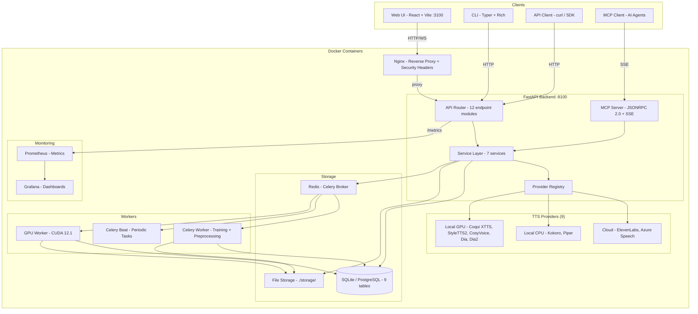
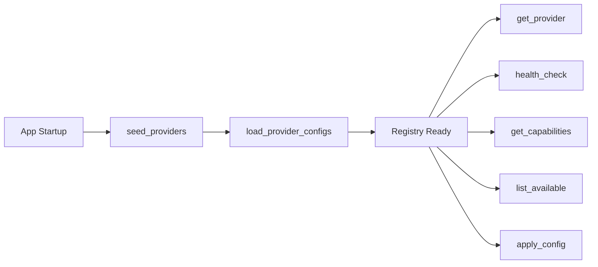
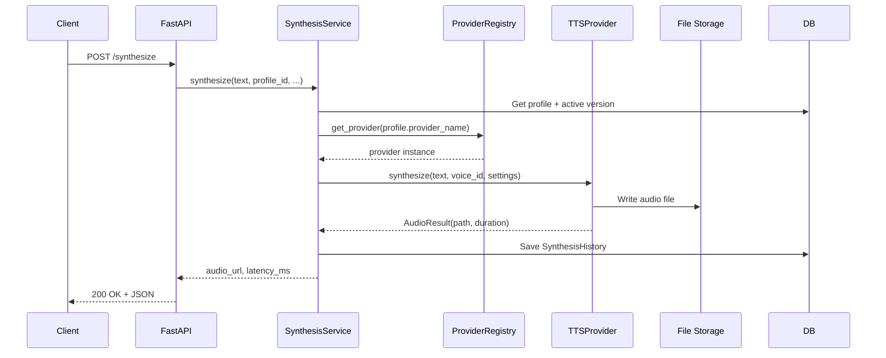
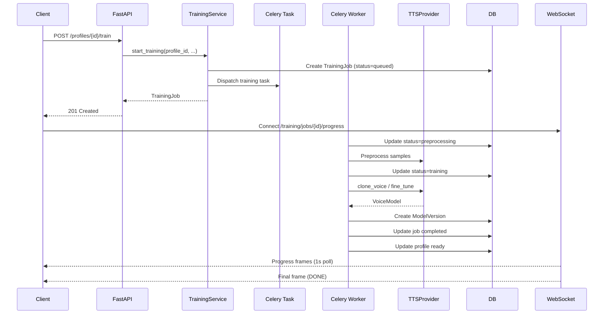
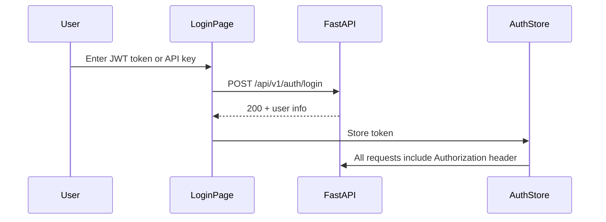
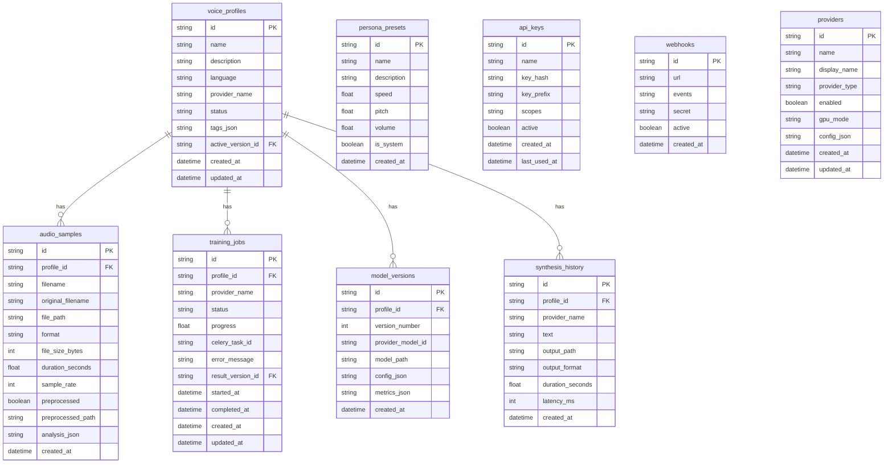

# 🏗️ Atlas Vox Architecture

> System architecture, component design, and data flow documentation.

---

## Table of Contents

- [System Overview](#-system-overview)
- [Architecture Diagram](#-architecture-diagram)
- [Component Overview](#-component-overview)
- [Provider Abstraction Pattern](#-provider-abstraction-pattern)
- [Data Flow: Synthesis](#-data-flow-synthesis)
- [Data Flow: Training](#-data-flow-training)
- [Technology Stack](#-technology-stack)
- [Exception Hierarchy](#-exception-hierarchy)
- [Authentication Flow](#-authentication-flow)
- [API Client Resilience](#-api-client-resilience)
- [Security Headers](#-security-headers)
- [Monitoring Stack](#-monitoring-stack)
- [Celery Beat Scheduler](#-celery-beat-scheduler)
- [Database Schema](#-database-schema)
- [Directory Structure](#-directory-structure)

---

## 🎯 System Overview

Atlas Vox is a modular, self-hosted platform with four entry points (Web UI, REST API, CLI, MCP Server) that all converge on a shared backend layer. The backend orchestrates **9 TTS providers** through a unified abstraction, manages voice profiles and training jobs, and persists data in a relational database.

**Key architectural decisions:**
- **Provider abstraction**: Every TTS engine implements a common `TTSProvider` ABC. The UI adapts dynamically based on each provider's declared capabilities.
- **Async-first**: All backend services use `async def` with SQLAlchemy async and aiosqlite/asyncpg.
- **Background workers**: CPU/GPU-intensive tasks (training, preprocessing) run in Celery workers, keeping the API server responsive. Celery Beat handles periodic tasks (audio cleanup, health checks).
- **Config-driven**: All settings flow through Pydantic Settings, supporting `.env` files, environment variables, and runtime DB overrides.
- **Typed exceptions**: A hierarchy of domain-specific exceptions (`AtlasVoxError` subclasses) maps automatically to HTTP status codes via global middleware.
- **Database per environment**: SQLite for local development simplicity; PostgreSQL (via asyncpg) for Docker deployments to prevent corruption across backend and worker containers.
- **Resilient frontend**: API client with retry/backoff, AbortController cancellation, and staleness guards in Zustand stores.
- **Observability**: Prometheus metrics + Grafana dashboards for production monitoring.

---

## 📐 Architecture Diagram



### ASCII Architecture Diagram

```
+------ Docker Containers -----------------------------------------+
|                                                                   |
|  Nginx :80/443 (CSP, HSTS, X-Frame-Options)                     |
|    |                                                              |
|  Web UI :3100   ----+                                            |
|  CLI (Typer)    ----+---> FastAPI Backend :8100                  |
|  API Client     ----+      |                                     |
|  MCP Client     ----+      +---> Provider Registry               |
|                             |      |                              |
|                             |      +---> Cloud (ElevenLabs, Azure)|
|                             |      +---> CPU (Kokoro, Piper)      |
|                             |      +---> GPU (Coqui, StyleTTS2...)|
|                             |                                     |
|  Redis :6379 <-- Celery --> Worker                               |
|                  Celery --> Beat (periodic tasks)                 |
|  SQLite (dev) / PostgreSQL (Docker)                              |
|                                                                   |
|  Prometheus :9090 <-- /api/v1/metrics                            |
|  Grafana :3000 (auto-provisioned dashboards)                     |
+------------------------------------------------------------------+
```

---

## 🧩 Component Overview

### Frontend (React + TypeScript)

| Component | Purpose |
|-----------|---------|
| **Pages** (9+) | Lazy-loaded route components: Dashboard, Profiles, Library, Training, Synthesis, Comparison, Providers, API Keys, Settings, Help, Docs |
| **Stores** (5+) | Zustand state stores with staleness guards (`lastFetchedAt` + `STALE_MS` pattern) and AbortController integration: profiles, providers, training, synthesis, voice library, settings, admin |
| **Services** | Typed API client (`api.ts`) with 30+ methods, `fetchWithRetry()` with exponential backoff (1s/2s/4s base, max 8s, + jitter), AbortController integration |
| **Components** (40+) | UI primitives (Card, Button, Modal with focus trap/aria-modal/scroll lock, Badge), audio components (AudioPlayer, AudioRecorder), auth (ProtectedRoute, LoginPage), layout (Sidebar, AppLayout) |
| **Hooks** | WebSocket hook for training progress, audio playback hooks |

### Backend (FastAPI + Python)

| Layer | Purpose |
|-------|---------|
| **API Endpoints** (12 modules) | REST routes organized by resource: health, profiles, providers, voices, samples, training, synthesis, compare, audio, presets, api_keys, webhooks |
| **Services** (7) | Business logic: `profile_service`, `synthesis_service`, `training_service`, `comparison_service`, `audio_processor`, `provider_registry`, `webhook_dispatcher` |
| **Providers** (9) | TTS engine implementations extending `TTSProvider` ABC |
| **Models** (9) | SQLAlchemy async ORM: VoiceProfile, AudioSample, TrainingJob, ModelVersion, PersonaPreset, SynthesisHistory, ApiKey, Webhook, Provider |
| **Schemas** | Pydantic v2 request/response schemas with validation |
| **Tasks** | Celery background tasks: `training.py`, `preprocessing.py` |
| **Core** | Config (Pydantic Settings), Database, Security, Logging, Dependencies, Exceptions |

### Infrastructure

| Component | Technology | Purpose |
|-----------|-----------|---------|
| **Database** | SQLite (local dev) / PostgreSQL (Docker) | Persistent storage; Docker uses PostgreSQL via asyncpg to prevent corruption across containers |
| **Cache/Broker** | Redis 7 | Celery task broker, result backend |
| **Worker** | Celery 5 | Background training and preprocessing |
| **Scheduler** | Celery Beat | Periodic tasks (audio cleanup, health checks) |
| **Proxy** | Nginx | Frontend serving, API reverse proxy, security headers (CSP, HSTS, X-Frame-Options, X-Content-Type-Options, Permissions-Policy) |
| **Monitoring** | Prometheus + Grafana | Metrics scraping at `/api/v1/metrics`; Grafana auto-provisions a 4-panel dashboard (request rate, error rate, latency p99, system health) |

---

## 🔌 Provider Abstraction Pattern

The provider abstraction is the core architectural pattern in Atlas Vox. It allows the system to treat all TTS engines uniformly while adapting the UI based on each provider's capabilities.

### TTSProvider ABC

```python
class TTSProvider(ABC):
    """Abstract base for all TTS providers."""

    @abstractmethod
    async def synthesize(self, text, voice_id, settings) -> AudioResult: ...

    @abstractmethod
    async def clone_voice(self, samples, config) -> VoiceModel: ...

    @abstractmethod
    async def fine_tune(self, model_id, samples, config) -> VoiceModel: ...

    @abstractmethod
    async def list_voices(self) -> list[VoiceInfo]: ...

    @abstractmethod
    async def get_capabilities(self) -> ProviderCapabilities: ...

    @abstractmethod
    async def health_check(self) -> ProviderHealth: ...

    async def stream_synthesize(self, text, voice_id, settings) -> AsyncIterator[bytes]:
        raise NotImplementedError("Streaming not supported")
```

### ProviderCapabilities

Each provider declares its capabilities via a dataclass. The frontend reads these to adapt the UI dynamically:

```python
@dataclass
class ProviderCapabilities:
    supports_cloning: bool = False
    supports_fine_tuning: bool = False
    supports_streaming: bool = False
    supports_ssml: bool = False
    supports_zero_shot: bool = False
    supports_batch: bool = False
    requires_gpu: bool = False
    gpu_mode: str = "none"
    min_samples_for_cloning: int = 0
    max_text_length: int = 5000
    supported_languages: list[str] = field(default_factory=lambda: ["en"])
    supported_output_formats: list[str] = field(default_factory=lambda: ["wav"])
```

### Provider Registry

The `ProviderRegistry` manages provider lifecycle:



- **Seed**: Ensures all providers exist in the database
- **Load configs**: Merges env vars, DB config, and runtime overrides
- **Runtime**: Providers are instantiated lazily and configured on demand

### Configuration Layering

Provider configuration merges from three sources (later overrides earlier):

```
1. Schema defaults (Pydantic model defaults)
2. Database config (stored in provider.config_json)
3. Runtime overrides (env vars, API calls)
```

Secret fields (API keys) are masked with `****` in API responses and preserved when the masked value is sent back.

### All 9 Providers

| # | Provider | Type | Module | Runtime |
|---|----------|------|--------|---------|
| 1 | Kokoro | Local CPU | `kokoro_tts.py` | Docker |
| 2 | Piper | Local CPU | `piper_tts.py` | Docker |
| 3 | ElevenLabs | Cloud | `elevenlabs.py` | Docker |
| 4 | Azure Speech | Cloud | `azure_speech.py` | Docker |
| 5 | Coqui XTTS v2 | Local GPU | `coqui_xtts.py` | Docker |
| 6 | StyleTTS2 | Local GPU | `styletts2.py` | Docker |
| 7 | CosyVoice | Local GPU | `cosyvoice.py` | Docker |
| 8 | Dia | Local GPU | `dia.py` | Docker |
| 9 | Dia2 | Local GPU | `dia2.py` | Docker |

---

## 🔊 Data Flow: Synthesis



**Key points:**
- Profile determines which provider and voice to use
- Active model version (if any) is passed as the voice ID
- Audio files are saved to `storage/output/`
- Each synthesis is recorded in `synthesis_history` table

---

## 🎓 Data Flow: Training



**Key points:**
- Training is asynchronous via Celery
- WebSocket provides real-time progress updates
- Each successful training creates a new ModelVersion
- Profile status transitions: pending -> training -> ready (or error)

---

## 🛠️ Technology Stack

### Backend

| Technology | Version | Purpose |
|-----------|---------|---------|
| Python | 3.11+ | Runtime |
| FastAPI | 0.115+ | Web framework |
| Pydantic | v2 | Validation and settings |
| SQLAlchemy | 2.0+ (async) | ORM |
| aiosqlite | 0.20+ | Async SQLite driver (local dev) |
| asyncpg | 0.29+ | Async PostgreSQL driver (Docker deployments, optional `[postgres]` extra) |
| Alembic | 1.13+ | Database migrations |
| Celery | 5.3+ | Background task queue |
| Redis | 5.0+ | Celery broker |
| structlog | 24.0+ | Structured logging |
| python-jose | 3.3+ | JWT authentication |
| argon2-cffi | 23.1+ | Password/API key hashing |

### Frontend

| Technology | Version | Purpose |
|-----------|---------|---------|
| React | 18+ | UI framework |
| TypeScript | 5+ | Type safety |
| Vite | 5+ | Build tool |
| Tailwind CSS | 3+ | Styling |
| Zustand | Latest | State management |
| Sonner | Latest | Toast notifications |
| Lucide React | Latest | Icons |
| React Router | v6 | Client-side routing |

### Infrastructure

| Technology | Purpose |
|-----------|---------|
| Docker | Containerization |
| Docker Compose | Service orchestration |
| Nginx | Frontend serving, reverse proxy |
| NVIDIA Container Toolkit | GPU passthrough |
| CUDA 12.1 | GPU compute |
| Prometheus | Metrics collection and scraping |
| Grafana | Metrics dashboards and visualization |

---

## 🚨 Exception Hierarchy

Atlas Vox uses a typed exception system defined in `backend/app/core/exceptions.py`. All custom exceptions extend `AtlasVoxError` and are automatically mapped to HTTP status codes by the global exception handler in `middleware.py`.

```
AtlasVoxError (base)
├── NotFoundError          → HTTP 404
├── ValidationError        → HTTP 422
├── ProviderError          → HTTP 502
├── AuthenticationError    → HTTP 401
├── AuthorizationError     → HTTP 403
├── StorageError           → HTTP 500
├── TrainingError          → HTTP 500
└── ServiceError           → HTTP 500
```

Services raise these typed exceptions instead of raw `HTTPException`. The middleware catches them and returns consistent JSON error responses with the appropriate status code, error type, and message.

---

## 🔐 Authentication Flow

Authentication supports two modes controlled by the `AUTH_DISABLED` environment variable:

### Multi-User Mode (`AUTH_DISABLED=false`)



- **ProtectedRoute** component (`frontend/src/components/ProtectedRoute.tsx`) wraps all main routes, redirecting unauthenticated users to the login page.
- **LoginPage** (`frontend/src/pages/LoginPage.tsx`) accepts JWT tokens or API keys.
- Auth headers are injected automatically by the API client from `authStore`.

### Single-User Mode (`AUTH_DISABLED=true`)

When auth is disabled, the frontend auto-authenticates on load by hitting `/api/v1/health`. No login is required and `ProtectedRoute` passes through immediately.

---

## 🔄 API Client Resilience

The frontend API client (`frontend/src/services/api.ts`) includes built-in resilience patterns:

### Retry with Exponential Backoff

`fetchWithRetry()` automatically retries failed requests:
- **Base delays**: 1s, 2s, 4s (exponential)
- **Max delay**: 8s cap
- **Jitter**: Random jitter added to each delay to prevent thundering herd
- **Retryable**: Only retries on network errors and 5xx responses

### Request Cancellation

All Zustand stores integrate `AbortController` to cancel in-flight requests:
- `voiceLibraryStore`, `profileStore`, `providerStore`, `synthesisStore` all support cancellation
- Previous requests are aborted when new ones are initiated
- Component unmounts trigger cleanup via AbortController

### Staleness Guards

Stores use a `lastFetchedAt` + `STALE_MS` pattern to avoid redundant API calls. Data is only re-fetched if it exceeds the staleness threshold.

---

## 🛡️ Security Headers

Nginx adds the following security headers to all responses:

| Header | Value | Purpose |
|--------|-------|---------|
| `Content-Security-Policy` | Restrictive CSP | Prevents XSS and injection attacks |
| `X-Frame-Options` | `SAMEORIGIN` | Prevents clickjacking |
| `X-Content-Type-Options` | `nosniff` | Prevents MIME type sniffing |
| `Strict-Transport-Security` | HSTS with max-age | Enforces HTTPS |
| `Permissions-Policy` | Restrictive policy | Controls browser feature access |

---

## 📊 Monitoring Stack

Prometheus and Grafana are integrated via Docker Compose for production observability.

### Metrics Collection

- The backend exposes a `/api/v1/metrics` endpoint in Prometheus format
- Prometheus scrapes this endpoint on a configurable interval
- Metrics include request counts, error rates, latency histograms, and system health indicators

### Grafana Dashboards

Grafana auto-provisions on startup with a pre-configured **Atlas Vox** dashboard containing 4 panels:

| Panel | Metric | Purpose |
|-------|--------|---------|
| Request Rate | `http_requests_total` | Traffic volume over time |
| Error Rate | `http_requests_total{status=~"5.."}` | 5xx error trend |
| Latency P99 | `http_request_duration_seconds` | 99th percentile response time |
| System Health | Provider health checks | Overall system status |

---

## ⏰ Celery Beat Scheduler

A Celery Beat service runs alongside workers to handle periodic tasks:

| Task | Schedule | Purpose |
|------|----------|---------|
| Audio cleanup | Periodic | Removes orphaned/temporary audio files from storage |
| Health checks | Periodic | Verifies provider availability and updates status |

Beat is deployed as a separate container in Docker Compose, sharing the same Redis broker as the workers.

---

## 🗄️ Database Schema



---

## 📁 Directory Structure

```
atlas-vox/
├── backend/
│   ├── app/
│   │   ├── api/v1/endpoints/       # 12 API endpoint modules (60+ routes)
│   │   ├── core/                   # Config, Database, Security, Logging, Exceptions
│   │   ├── models/                 # 9 SQLAlchemy ORM models
│   │   ├── schemas/                # Pydantic v2 request/response schemas
│   │   ├── services/               # 7 business logic services
│   │   ├── providers/              # 9 TTS provider implementations
│   │   ├── tasks/                  # Celery background tasks
│   │   ├── cli/                    # Typer CLI commands
│   │   ├── mcp/                    # MCP server (JSONRPC 2.0)
│   │   └── main.py                 # FastAPI app entry point
│   ├── tests/                      # Pytest suite (43+ tests)
│   ├── migrations/                 # Alembic migrations
│   └── pyproject.toml
├── frontend/
│   ├── src/
│   │   ├── pages/                  # 11 lazy-loaded React pages
│   │   ├── components/             # 40+ UI, audio, layout components
│   │   ├── stores/                 # 5+ Zustand state stores
│   │   ├── services/               # Typed API client (api.ts)
│   │   ├── hooks/                  # WebSocket, audio hooks
│   │   ├── data/                   # Static data (providerMetadata)
│   │   └── types/                  # TypeScript interfaces
│   └── package.json
├── docker/                         # Dockerfiles + compose configs
├── docs/                           # Documentation
├── Makefile                        # Development commands
└── CLAUDE.md                       # Project instructions
```

---

<div align="center">

[Back to User Guide](USER_GUIDE.md) | [API Reference](API_REFERENCE.md) | [Deployment Guide](DEPLOYMENT.md)

</div>
